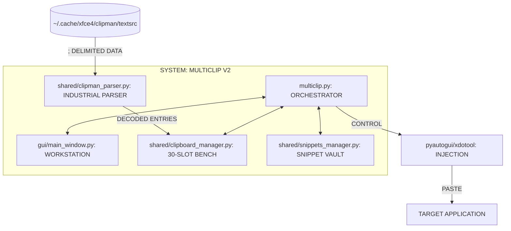
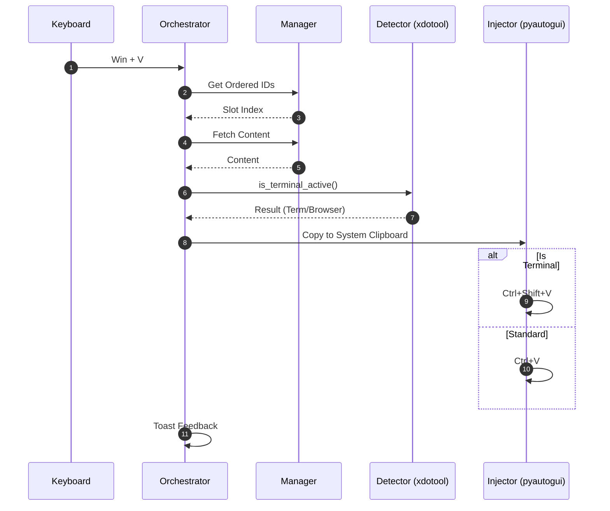

# DEVRYTHING_GOSPEL.md: MULTICLIP V2 INDUSTRIAL WORKSTATION

## I. GOSPEL SUMMARY
THE MULTICLIP V2 INDUSTRIAL WORKSTATION IS A DETERMINISTIC PIPELINE DESIGNED FOR HIGH-DENSITY CLIPBOARD MANAGEMENT AND TERMINAL-AWARE DATA INJECTION. IT ELIMINATES KEYBOARD CONFLICTS, PROVIDES INDUSTRIAL-GRADE FEEDBACK, AND PERSISTS DATA THROUGH A LEAN, INDUSTRIAL-GRADE VAULT.

## II. SYSTEM ARCHITECTURE (C4 CONTAINER MODEL)

## III. THE PASTE STRIKE PIPELINE (Win + V)

## IV. TECHNICAL INVARIANTS (THE LAW)
1.  **INDUSTRIAL PARSER**: Must parse `;` separated strings, handle `\;` (literal semicolon), `
` (newline), `\s` (space), `	` (tab). Reading from the end of the 31MB file is MANDATORY.
2.  **TERMINAL TAX**: Every paste operation must use `xdotool` to detect if the target is a terminal to correctly toggle `Ctrl+V` vs `Ctrl+Shift+V`.
3.  **UNIFIED BENCH**: The 30-slot grid holds all state. 1-30 numbering is handled by custom fields in the UI. Normalize sequence resets to 1-30.
4.  **OPERATIONAL TOAST**: Every command (Copy, Paste, Save, Edit) must return an industrial toast notification with: [Source/Slot] → [Action] → [Preview]. NO EXCEPTIONS.
5.  **VAULT INTEGRATION**: Snippets have persistent hotkeys (`Win + Alt + 1-0`).

## V. OPERATIONAL EMERGENCY: THE "STICKY SUPER"
If the Super key gets stuck, execute `pyautogui.keyUp('win')` immediately. The workstation has been calibrated to release it before every operation. 

**AUTHENTICATED BY DEVRYTHING_COLLECTIVE_01** 
**4SHO.**
