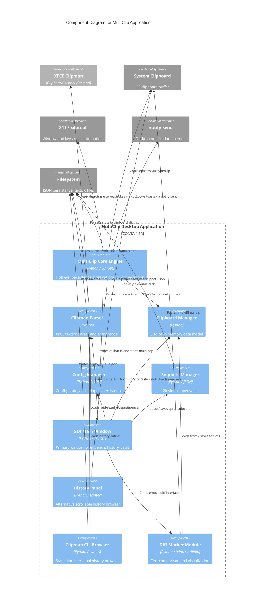
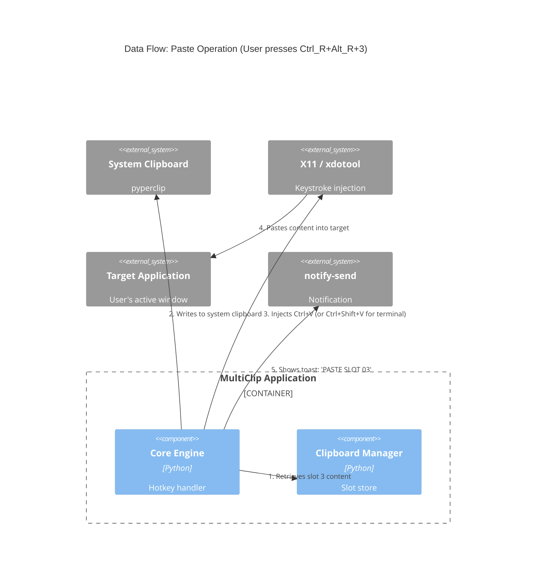

# C4 Component Level: MultiClip System Overview

## Use this skill when

- Working on c4 component level: MultiClip tasks or workflows
- Needing guidance, best practices, or checklists for c4 component level: MultiClip

## Do not use this skill when

- The task is unrelated to c4 component level: MultiClip
- You need a different domain or tool outside this scope

---

# C4 Component Level: MultiClip Core Engine

## Overview

- **Name**: MultiClip Core Engine
- **Description**: Central orchestrator that manages the application lifecycle, global hotkey interception, clipboard slot persistence, system notifications, and UI delegation.
- **Type**: Application / Orchestrator
- **Technology**: Python 3, pynput, pyautogui, pyperclip, tkinter

## Purpose

The MultiClip Core Engine is the entry point and central nervous system of the MultiClip V2 application. It ensures only one instance runs (via kernel-level file locking), registers global hotkey listeners for copy/paste operations across 30 numbered slots, persists slot contents to JSON, triggers system notifications, and wires together the GUI and Clipman history integrations. It handles the critical user-facing loop: intercept Ctrl+Alt+Digit to copy into a slot, and Ctrl_R+Alt_R+Digit to paste from a slot.

## Software Features

- **Single-Instance Guard**: Uses `fcntl.flock` on `/tmp/multiclip.lock` to prevent multiple instances.
- **Global Hotkey Interception**: Listens to all keyboard events via `pynput.keyboard.Listener`, tracking held modifier keys (Ctrl, Alt) to detect left-side (copy) and right-side (paste) combos.
- **30-Slot Clipboard Storage**: Maintains an in-memory dictionary (`slots`) keyed "1" through "30", persisted to `clipboard_dict.json`.
- **Clipboard Injection**: Copies slot content to the system clipboard then injects paste commands using `xdotool` (preferred) or `pyautogui` fallback, with terminal-aware detection.
- **System Toast Notifications**: Calls `notify-send` with the Chargers logo for every copy/paste action, showing slot number and content preview.
- **Emergency Persistence**: Registers `atexit` and signal handlers (`SIGINT`, `SIGTERM`) to save slot state before shutdown.
- **Old UI Wiring**: Attempts to load and populate `gui.main_window.MainWindow`; falls back to a minimal tkinter window on failure.
- **Clipman Integration**: Wires the Clipman history panel into the old UI and starts live polling (3-second interval) for new clipboard history entries.
- **Smart Transfer Logic**: Transfers selected Clipman history entries into OG slots with empty-slot-first allocation, user prompt on overflow, and overwrite-oldest fallback.

## Code Elements

This component contains the following code-level elements:

- `multiclip.py` - Main application class (`MultiClipV2`), hotkey registration, slot persistence, clipboard operations, UI wiring, and toast notifications.

## Interfaces

### Hotkey Event Interface

- **Protocol**: Internal event-driven (pynput callbacks)
- **Description**: Intercepts global keyboard press/release events and maps modifier+digit combinations to slot operations.
- **Operations**:
  - `on_press(key)`: void - Tracks held modifiers and triggers `_handle_combo(slot)` when a digit is pressed with Ctrl+Alt held.
  - `on_release(key)`: void - Removes released modifiers from the held set.
  - `_handle_combo(slot: int)`: void - Routes to `add_to_slot(slot)` (left combo) or `paste_from_slot(slot)` (right combo).

### Slot Persistence Interface

- **Protocol**: File I/O (JSON)
- **Description**: Loads and saves the 30-slot dictionary to `clipboard_dict.json`.
- **Operations**:
  - `load_slots()`: void - Reads `clipboard_dict.json` and populates `self.slots` with forward/backward compatibility logic.
  - `save_slots()`: void - Writes `{"slots": {...}}` to `clipboard_dict.json`.

### Clipboard Operation Interface

- **Protocol**: System clipboard + X11 automation
- **Description**: Performs the actual copy-from-application and paste-into-application operations.
- **Operations**:
  - `add_to_slot(slot_num: int)`: void - Sends Ctrl+C via pyautogui, reads clipboard via pyperclip, stores in slot, saves, and shows toast.
  - `paste_from_slot(slot_num: int)`: void - Copies slot content to clipboard, detects if target is a terminal, sends appropriate paste keystrokes via xdotool or pyautogui, and shows toast.
  - `_is_terminal()`: bool - Uses `xdotool getactivewindow` + `xprop WM_CLASS` to determine if the focused window is a terminal emulator.

### UI Wiring Interface

- **Protocol**: Internal method delegation
- **Description**: Connects the Core Engine to the GUI layer and Clipman history.
- **Operations**:
  - `_wire_old_ui()`: void - Populates `MainWindow` slot displays with current slot contents.
  - `_wire_clipman_panel()`: void - Parses full Clipman history, injects entries into the GUI, sets transfer callback, and starts live polling.
  - `_transfer_clipman_to_og_slots(selected_entries)`: void - Smart batch/one-slot transfer of Clipman entries into OG slots.

### Notification Interface

- **Protocol**: External process invocation (notify-send)
- **Description**: Displays transient desktop notifications for user feedback.
- **Operations**:
  - `show_toast(title: str, message: str)`: void - Invokes `notify-send` with the Chargers logo and a 3200ms timeout.

## Dependencies

### Components Used

- **GUI Main Window**: The Core Engine instantiates `MainWindow` (from `gui/main_window.py`) and wires callbacks into it.
- **Clipman Parser**: Used to load history entries for the right-panel integration (`shared/clipman_parser.ClipmanParser`).

### External Systems

- **System Clipboard (pyperclip)**: Primary mechanism for reading and writing clipboard content.
- **X11 / xdotool**: Used for reliable paste keystroke injection, especially when running as root.
- **notify-send**: Linux desktop notification daemon for user-facing toasts.
- **pynput**: Cross-platform keyboard listener for global hotkey capture.
- **pyautogui**: Fallback for keystroke injection and modifier release.

---

# C4 Component Level: Clipboard Manager

## Overview

- **Name**: Clipboard Manager
- **Description**: In-memory data model for the 30 numbered clipboard slots, providing typed slot objects with ordering support.
- **Type**: Library / Data Model
- **Technology**: Python 3

## Purpose

The Clipboard Manager provides a clean, object-oriented abstraction over the raw slot dictionary. Each slot is represented as a `ClipboardSlot` object that tracks content, an explicit ordering number, a timestamp, and an auto-generated preview. The manager supports ordered retrieval of non-empty slots, which powers the "Orderly" and "Sequential" paste modes.

## Software Features

- **Typed Slot Objects**: `ClipboardSlot` encapsulates `id`, `content`, `order`, `timestamp`, and `preview`.
- **Auto-Generated Previews**: Each slot generates a 50-character single-line preview on content update.
- **Ordered Retrieval**: `get_ordered_indices()` returns active slots sorted by their explicit `order` field.
- **Slot Lifecycle**: Store, retrieve, and clear operations with bounds checking.

## Code Elements

This component contains the following code-level elements:

- `shared/clipboard_manager.py` - `ClipboardSlot` dataclass-like class and `ClipboardManager` orchestrator.

## Interfaces

### Slot Management Interface

- **Protocol**: Direct Python method calls
- **Description**: Provides CRUD-like operations on the 30-slot backing store.
- **Operations**:
  - `store_in_slot(slot_id: int, content: str) -> bool`: Stores content in the specified slot; returns `True` on success.
  - `get_slot_content(slot_id: int) -> Optional[str]`: Returns the raw content of a slot, or `None` if out of bounds.
  - `get_ordered_indices() -> List[int]`: Returns IDs of non-empty slots sorted by `(order, id)`.
  - `clear_all_slots()`: Clears content from all 30 slots.

## Dependencies

### Components Used

- None (pure data model; used by Core Engine and GUI).

### External Systems

- None

---

# C4 Component Level: Clipman Parser

## Overview

- **Name**: Clipman Parser
- **Description**: Robust parser for the XFCE Clipman `textsrc` history file, converting raw escaped text into clean, structured clipboard entries.
- **Type**: Library / Parser
- **Technology**: Python 3

## Purpose

XFCE's Clipman plugin stores clipboard history in a custom text file (`~/.cache/xfce4/clipman/textsrc`) where entries are separated by unescaped semicolons and internal semicolons are escaped as `\;`. Newlines, spaces, and tabs are also escaped. The Clipman Parser reads this file, handles the multi-user / root execution fallback logic, splits entries correctly, decodes escape sequences, and produces a list of `ClipEntry` objects with auto-generated previews and word counts.

## Software Features

- **Multi-User Path Resolution**: Automatically resolves the correct `textsrc` path, including fallbacks for `SUDO_USER` and hardcoded environment paths (`/home/flintx`).
- **Escaped Semicolon Splitting**: Custom `_split_on_unescaped_semicolon` tokenizer that respects `\;` escapes.
- **Escape Sequence Decoding**: Decodes `\;`, `\n`, `\s`, `\t`, `\r` into their literal equivalents.
- **Auto-Preview Generation**: Extracts the first non-empty line and truncates to 80 characters.
- **Reverse Chronological Ordering**: Returns newest entries first (index 0 = most recent).
- **Empty Entry Filtering**: Skips entries that decode to whitespace-only content.

## Code Elements

This component contains the following code-level elements:

- `shared/clipman_parser.py` - `ClipEntry` dataclass and `ClipmanParser` class.

## Interfaces

### Parse Interface

- **Protocol**: File I/O + Python method calls
- **Description**: Reads and parses the Clipman history file into structured entries.
- **Operations**:
  - `parse(max_entries: int = 200) -> List[ClipEntry]`: Reads `textsrc`, splits, decodes, filters, and returns up to `max_entries` newest entries.
  - `get_recent(count: int = 50) -> List[ClipEntry]`: Convenience wrapper returning the `count` most recent entries.

### Entry Data Interface

- **Protocol**: Python dataclass properties
- **Description**: Exposes structured data for each clipboard history item.
- **Operations**:
  - `ClipEntry.decoded_content`: str - The fully decoded text content.
  - `ClipEntry.preview`: str - Single-line preview (first non-empty line, max 80 chars).
  - `ClipEntry.word_count`: int - Word count of decoded content.
  - `ClipEntry.is_empty`: bool - True if decoded content is whitespace-only.

## Dependencies

### Components Used

- None (standalone parser library).

### External Systems

- **XFCE Clipman textsrc file**: `~/.cache/xfce4/clipman/textsrc` (or root/user fallback paths).

---

# C4 Component Level: Config Manager

## Overview

- **Name**: Config Manager
- **Description**: Unified configuration, state, and snippets persistence layer with dot-path key access and default-value merging.
- **Type**: Library / Configuration
- **Technology**: Python 3, JSON

## Purpose

The Config Manager centralizes all user-facing configuration (hotkey mappings, GUI preferences, behavior settings, terminal detection), runtime state, and saved snippets. It uses `~/.multiclip/` as its storage directory, merges loaded config with sensible defaults to handle schema evolution, and supports dot-path access (`hotkeys.copy_to_slot`) for ergonomic reads and writes.

## Software Features

- **Default Config Merging**: New options are automatically backfilled from hardcoded defaults when loading an older config file.
- **Dot-Path Access**: `get("gui.theme")` and `set("gui.theme", "dark")` for nested config navigation.
- **Hotkey Templating**: `get_hotkey(action, slot)` interpolates `{slot}` placeholders into concrete key combinations.
- **State Persistence**: Separate `state.json` for transient runtime data.
- **Snippet Persistence**: Separate `snippets.json` for the snippet vault.

## Code Elements

This component contains the following code-level elements:

- `shared/config_manager.py` - `ConfigManager` class.

## Interfaces

### Configuration Access Interface

- **Protocol**: Python method calls + JSON file I/O
- **Description**: Read/write application configuration with nested key support.
- **Operations**:
  - `get(key_path: str, default: Any = None) -> Any`: Dot-path retrieval into the config tree.
  - `set(key_path: str, value: Any)`: Dot-path assignment with automatic save.
  - `save_config(config: Optional[dict])`: Persists the current config to `~/.multiclip/config.json`.
  - `get_hotkey(action: str, slot: Optional[int]) -> Optional[str]`: Returns a hotkey string with `{slot}` interpolated.

### State & Snippet Interface

- **Protocol**: Python method calls + JSON file I/O
- **Description**: Persists runtime state and user snippets independently of main config.
- **Operations**:
  - `save_state(state_data: dict)`: Writes to `~/.multiclip/state.json`.
  - `load_state() -> dict`: Reads from `~/.multiclip/state.json`.
  - `save_snippets(snippets_data: dict)`: Writes to `~/.multiclip/snippets.json`.
  - `load_snippets() -> dict`: Reads from `~/.multiclip/snippets.json`.

## Dependencies

### Components Used

- None (standalone configuration library).

### External Systems

- **Filesystem**: `~/.multiclip/` directory for config/state/snippet JSON files.

---

# C4 Component Level: Snippets Manager

## Overview

- **Name**: Snippets Manager
- **Description**: Lightweight persistent snippet vault with 20 numbered slots and pre-seeded default content.
- **Type**: Library / Data Store
- **Technology**: Python 3, JSON

## Purpose

The Snippets Manager stores fixed text fragments (email addresses, shell aliases, proxy exports, notes) that survive application restarts. It pre-seeds four commonly used snippets on first run and provides simple get/set operations against a JSON file.

## Software Features

- **20-Slot Vault**: Fixed-size dictionary keyed 0-19.
- **Pre-Seeded Defaults**: Auto-populates with tunnel alias, proxy exports, pip notes, and an email on first run.
- **Atomic Save**: Overwrites the JSON file on every `set_snippet` call.

## Code Elements

This component contains the following code-level elements:

- `shared/snippets_manager.py` - `SnippetVault` class.

## Interfaces

### Snippet Vault Interface

- **Protocol**: Python method calls + JSON file I/O
- **Description**: Simple get/set persistence for text snippets.
- **Operations**:
  - `set_snippet(index: int, content: str)`: Stores snippet at index 0-19 and saves.
  - `get_snippet(index: int) -> Optional[str]`: Retrieves snippet content.
  - `load()`: Reads `snippets.json` from disk; seeds defaults if missing.
  - `save()`: Writes current snippets to disk.

## Dependencies

### Components Used

- None (standalone data store).

### External Systems

- **Filesystem**: `snippets.json` (or custom path) for JSON persistence.

---

# C4 Component Level: GUI Main Window

## Overview

- **Name**: GUI Main Window
- **Description**: Dense, industrial-style Tkinter primary window hosting the 30-slot workbench, Clipman history browser, snippet vault, snippets panel, and live-polling integration.
- **Type**: Application / GUI
- **Technology**: Python 3, tkinter, ttk

## Purpose

The GUI Main Window is the primary visual interface for MultiClip V2. It presents a two-column workbench of 30 editable slots, a right-hand Clipman history panel with pagination and batch/one-slot transfer, a bottom-left quick snippets area, and a status bar. It supports live auto-refresh of Clipman history, modal edit overlays, preview popups, and toast notifications.

## Software Features

- **30-Slot Workbench**: Two-column scrollable grid (slots 1-15 left, 16-30 right) with order field, slot ID, content preview, and character count.
- **Slot Interactions**: Left-click selects, right-click opens an `EditOverlay` modal.
- **Mode Toolbar**: Radiobuttons for Multiclip / Orderly / Vault / Sequential modes.
- **Clipman History Panel**: Paginated Listbox (50 items/page) with Prev/Next, Lock Selection, Transfer as Batch, and Transfer as One Slot buttons.
- **Live Polling**: `_poll_clipman()` runs every 3 seconds, detects `textsrc` mtime changes, and refreshes the list.
- **Clipman Preview Popup**: `ClipmanPreviewPopup` allows single-item or all-items full-text preview with navigation.
- **Edit Overlay**: Modal `Toplevel` with a full `Text` widget for editing long slot/vault content.
- **Toast Notifications**: Custom borderless `Toplevel` with logo, styled text, and auto-dismiss.
- **Snippets Panel**: 8 quick snippet entry fields with per-row Save buttons, persisted to JSON.
- **Vault Panel**: 10 snippet vault entry fields with Save and Edit buttons.

## Code Elements

This component contains the following code-level elements:

- `gui/main_window.py` - `MainWindow`, `SlotDisplay`, `EditOverlay`, and `ClipmanPreviewPopup` classes.

## Interfaces

### Slot Display Interface

- **Protocol**: Tkinter widget callbacks
- **Description**: Individual row widget representing one clipboard slot.
- **Operations**:
  - `update_content(content: str, preview: str)`: Refreshes the preview label and character count.
  - `set_order(order_num: int)`: Updates the order field value.

### Main Window Callback Interface

- **Protocol**: Python callable delegation
- **Description**: The MainWindow exposes callback hooks that the Core Engine (or other controllers) can attach to.
- **Operations**:
  - `set_clipboard_manager(clipboard_manager)`: Injects the data model for slot clearing.
  - `set_clipman_entries(entries: list)`: Receives parsed `ClipEntry` objects and renders paginated list.
  - `set_clipman_transfer_callback(callback: Callable)`: Sets the function called when user clicks Transfer.
  - `start_live_clipman_refresh(parser, interval_ms)`: Begins the `after()` polling loop.
  - `update_slot(slot_id, content, preview)`: Directly updates a `SlotDisplay` row.
  - `show_toast(action, slot, preview, duration)`: Displays a styled custom toast.

### Edit Overlay Interface

- **Protocol**: Tkinter modal dialog
- **Description**: Full-text editor for slot or vault content.
- **Operations**:
  - `save()`: Retrieves text content, calls the injected `on_save` callback, and destroys the window.

## Dependencies

### Components Used

- **Clipboard Manager**: Used for clearing all slots.
- **Clipman Parser**: Receives entry objects for display and live refresh.
- **Core Engine**: Provides the transfer callback and clipboard manager instance.

### External Systems

- **Tkinter / Tcl**: GUI framework.
- **Chargers Logo (`chargers.png`)**: Loaded for toast notifications and branding.

---

# C4 Component Level: History Panel

## Overview

- **Name**: History Panel
- **Description**: Alternative, ttk-styled scrollable clipman history browser designed for direct embedding in the main GUI.
- **Type**: Application / GUI Subcomponent
- **Technology**: Python 3, tkinter, ttk

## Purpose

The History Panel is an alternate implementation of the Clipman history viewer (distinct from the one baked into `MainWindow`). It uses a canvas-with-scrollbar approach for smoother rendering of `HistoryItem` widgets, supports search, select/order modes, pagination, and deploys selected entries back into slots via a callback.

## Software Features

- **Canvas-Based Scrolling**: Smoother scrolling for large history lists compared to a native Listbox.
- **Select vs Order Modes**: Toggle between multi-select and ordered (1-9) assignment.
- **Search Filtering**: Text search against history entries.
- **Per-Item Widgets**: Each entry is a full `HistoryItem` frame with checkbox, index, order label, preview, and word count.
- **Double-Click to Copy**: Copies the full decoded content to the system clipboard.

## Code Elements

This component contains the following code-level elements:

- `gui/history_panel.py` - `HistoryPanel` and `HistoryItem` classes.

## Interfaces

### History Panel Interface

- **Protocol**: Tkinter widget + Python callbacks
- **Description**: Embedded panel for browsing and deploying clipman history.
- **Operations**:
  - `load_history()`: Loads up to 500 entries from the parser and refreshes display.
  - `search()`: Filters entries by the search query.
  - `deploy_selection()`: Collects selected/ordered entries and calls `on_deploy` callback.
  - `toggle_mode()`: Switches between Select and Order modes.
  - `prev_page() / next_page()`: Paginates through results.

## Dependencies

### Components Used

- **Clipman Parser**: Injected at construction; used to load and search entries.

### External Systems

- **pyperclip**: Used for double-click "copy to clipboard" functionality.

---

# C4 Component Level: Clipman CLI Browser

## Overview

- **Name**: Clipman CLI Browser
- **Description**: Standalone curses-based terminal UI for browsing Clipman history, multi-selecting entries, and deploying them to slots without launching the main GUI.
- **Type**: Application / CLI Tool
- **Technology**: Python 3, curses

## Purpose

The Clipman CLI Browser provides a keyboard-driven, terminal-native interface for power users who prefer not to use the Tkinter GUI. It supports browsing with arrow keys, multi-select with Space, ordered selection with number keys 1-9, paging with Left/Right, and deployment with Enter. It can either call a deploy callback or write selections to a queue file for later consumption.

## Software Features

- **Curses UI**: Full-color terminal interface with header, scrollable list, preview pane, and footer help.
- **Multi-Select**: Toggle selection with Spacebar.
- **Ordered Selection**: Press 1-9 in Ordered Mode to assign explicit deployment order.
- **Pagination**: Navigate large histories with Left/Right arrow keys (50 items per page).
- **Deploy Queue File**: When no callback is provided, writes to `~/.cache/multiclip/deploy_queue.json`.

## Code Elements

This component contains the following code-level elements:

- `clipman_cli.py` - `ClipmanBrowser`, `Selection` dataclass, and `main()` entry point.

## Interfaces

### CLI Browser Interface

- **Protocol**: curses TUI + file I/O
- **Description**: Terminal-based interaction for history browsing and deployment.
- **Operations**:
  - `load_entries(max_entries: int = 500)`: Loads history via `ClipmanParser`.
  - `toggle_selection()`: Adds/removes current index from selected set.
  - `set_order(order_num: int)`: Assigns an order number to the current selection.
  - `deploy_selections(ordered: bool = False)`: Deploys selected entries via callback or queue file.
  - `run(stdscr)`: Main curses event loop.

## Dependencies

### Components Used

- **Clipman Parser**: Imported to load and parse history entries.

### External Systems

- **Terminal / curses**: Requires a compatible terminal environment.

---

# C4 Component Level: Diff Marker Module

## Overview

- **Name**: Diff Marker Module
- **Description**: Self-contained text comparison subsystem with a unified diff engine, side-by-side diff engine, and a Tkinter-based visual diff interface.
- **Type**: Library / Subsystem
- **Technology**: Python 3, tkinter, ttk, difflib

## Purpose

The Diff Marker Module allows users to compare two text sources (clipboard slots, pasted text, or manually entered text) and visualize the differences in either unified or side-by-side format. It is designed as a standalone package (`diff_marker/`) that can be imported and used independently or embedded into the main GUI.

## Software Features

- **Unified Diff Generation**: Uses Python's `difflib.unified_diff` with configurable context lines.
- **Side-by-Side Diff Generation**: Uses `difflib.SequenceMatcher` opcodes to align left/right lines with change type annotation.
- **Color-Coded Results**: Tkinter text tags highlight equal (white), insert (green), delete (red), and replace (yellow) lines.
- **Slot Integration**: Can load text directly from clipboard slots into either panel.
- **Save to Slot**: Diff results can be saved back into a clipboard slot.
- **View Mode Toggle**: Switch between Side-by-Side and Unified views without re-computing.

## Code Elements

This component contains the following code-level elements:

- `diff_marker/diff_types.py` - `DiffType` enum, `DiffLine` dataclass, and `DiffResult` dataclass with auto-calculated statistics.
- `diff_marker/diff_manager.py` - `DiffManager` class: performs diff calculations and formats output.
- `diff_marker/diff_interface.py` - `DiffInterface` ttk.Frame: full GUI with input panels, result display, and action buttons.
- `diff_marker/__init__.py` - Package exports.

## Interfaces

### Diff Calculation Interface

- **Protocol**: Python method calls
- **Description**: Computes differences between two text bodies.
- **Operations**:
  - `calculate_diff(text1: str, text2: str, context_lines: int = 3) -> DiffResult`: Performs unified and side-by-side diff, returns structured result.
  - `get_diff_stats(diff_result: DiffResult) -> str`: Returns human-readable change statistics.
  - `format_unified_diff(diff_result: DiffResult) -> str`: Returns the raw unified diff string.

### Diff Visualization Interface

- **Protocol**: Tkinter widget interactions
- **Description**: GUI panel for entering text, triggering comparison, and viewing results.
- **Operations**:
  - `_load_from_slot(panel: str)`: Opens a dialog to pick a slot and loads its content into the specified panel.
  - `_paste_content(panel: str)`: Pastes system clipboard content into the specified panel.
  - `_perform_diff()`: Reads both panels, calls `DiffManager`, updates stats, switches to Result tab, and renders with color tags.
  - `_refresh_diff_display()`: Re-renders the result text based on the current view mode radio button.
  - `_save_result()`: Saves the current result text into a chosen clipboard slot.

### Diff Data Types Interface

- **Protocol**: Python dataclass properties
- **Description**: Structured data types for diff output.
- **Operations**:
  - `DiffResult.lines`: List of `DiffLine` objects with left/right content and change type.
  - `DiffResult.unified_diff`: str - Raw unified diff output.
  - `DiffResult.stats`: dict - Computed additions, deletions, modifications, total lines.

## Dependencies

### Components Used

- **Clipboard Manager**: Optional; used for slot loading and result saving.

### External Systems

- **pyperclip**: Used for paste-from-clipboard into diff panels.
- **difflib**: Python standard library for sequence comparison.

---

## Master Component Index

### System Components

| # | Component | Description | Primary File(s) |
|---|-----------|-------------|-----------------|
| 1 | **MultiClip Core Engine** | Orchestrator, hotkeys, persistence, notifications, UI wiring | `multiclip.py` |
| 2 | **Clipboard Manager** | In-memory 30-slot data model with ordering | `shared/clipboard_manager.py` |
| 3 | **Clipman Parser** | XFCE Clipman `textsrc` parser and entry model | `shared/clipman_parser.py` |
| 4 | **Config Manager** | Config/state/snippets persistence with dot-path access | `shared/config_manager.py` |
| 5 | **Snippets Manager** | 20-slot persistent snippet vault | `shared/snippets_manager.py` |
| 6 | **GUI Main Window** | Primary Tkinter window with workbench, history, vault, snippets | `gui/main_window.py` |
| 7 | **History Panel** | Alternate ttk-based scrollable clipman history browser | `gui/history_panel.py` |
| 8 | **Clipman CLI Browser** | Standalone curses terminal UI for history browsing | `clipman_cli.py` |
| 9 | **Diff Marker Module** | Text comparison engine with unified/side-by-side visualization | `diff_marker/*.py` |

---

## Component Relationships



---

## Component Data Flow

```mermaid
C4Component
    title Data Flow: Copy Operation (User presses Ctrl+Alt+3)

    Container_Boundary(multiclip, "MultiClip Application") {
        Component(core, "Core Engine", "Python", "Hotkey handler")
        Component(clipboardMgr, "Clipboard Manager", "Python", "Slot store")
        Component(guiMain, "GUI Main Window", "tkinter", "Slot display")
    }

    System_Ext(sysClip, "System Clipboard", "pyperclip")
    System_Ext(targetApp, "Target Application", "User's active window")
    System_Ext(notify, "notify-send", "Notification")

    Rel(targetApp, sysClip, "1. Ctrl+C copies selection")
    Rel(core, sysClip, "2. Reads clipboard content")
    Rel(core, clipboardMgr, "3. Stores in slot 3")
    Rel(core, filesystem, "4. Saves to clipboard_dict.json")
    Rel(core, guiMain, "5. Updates slot preview")
    Rel(core, notify, "6. Shows toast: 'COPY SLOT 03'")
```



---

## Key Distinctions

- **vs C4-Code agent**: This document synthesizes multiple code files into logical components (Core Engine, Parser, GUI, Diff Module). A Code agent would document individual classes like `MultiClipV2._handle_combo` or `DiffManager._generate_side_by_side_diff`.
- **vs C4-Container agent**: This diagram zooms into the single "MultiClip Desktop Application" container and shows its internal components. A Container agent would show how MultiClip relates to external containers like XFCE Clipman, a web dashboard, or a cloud sync service.
- **vs C4-Context agent**: This provides component-level detail (Diff Manager, History Panel, Config Manager). A Context agent would show the high-level system diagram: User -> MultiClip -> XFCE -> OS Clipboard.
