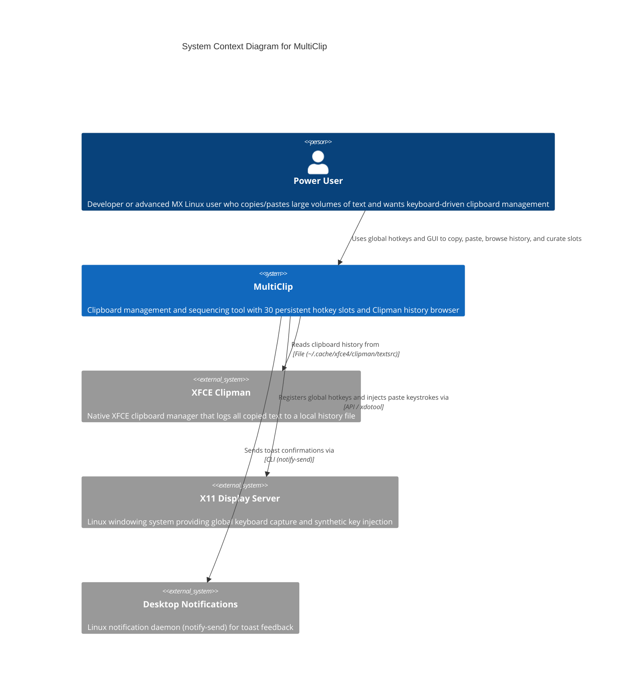

# MultiClip — C4 Context Level Documentation

## System Overview

### Short Description

MultiClip is a clipboard management and sequencing tool for MX Linux (XFCE) that provides 30 persistent hotkey-driven slots plus a curated history browser built on top of XFCE Clipman's clipboard log, enabling rapid copy-paste workflows, batch operations, and sequential text playback entirely from the keyboard.

### Long Description

MultiClip solves the problem of limited clipboard capacity on Linux workstations. Where standard clipboards hold only the most recent copy, MultiClip gives users 30 numbered "OG slots" that persist across reboots, each accessible via global hotkeys. Users copy text into slots with **Left Ctrl + Left Alt + digit** and paste from slots with **Right Ctrl + Right Alt + digit**.

Beyond the classic slot system, MultiClip integrates directly with XFCE Clipman's internal history file (`~/.cache/xfce4/clipman/textsrc`) to become a history curation and sequencing engine. Users can browse their full clipboard history, selectively transfer entries into the OG slots, and then execute sophisticated playback patterns — sequential paste (walking through a defined order) and batch paste (dumping multiple items). The application is designed to run headlessly as root on boot, owning global hotkeys reliably even in terminal windows, while a Tkinter-based GUI is available for visual browsing, editing, and curation when desired.

The project is currently in a transitional pivot: the reliable 30-slot core has been stabilized after multiple failed ambitious versions, and the new mandate is to turn MultiClip into a powerful organizer and sequencer on top of Clipman's history, without re-introducing the scope creep that destabilized prior attempts.

---

## Personas

### Power User (Primary Human User)

- **Type**: Human User
- **Description**: A developer or power user on MX Linux who copies and pastes large amounts of text throughout the day — code snippets, terminal commands, log lines, URLs, configuration blocks. They work heavily in terminals, editors, and browsers and need clipboard access without reaching for the mouse.
- **Goals**:
  - Copy multiple items in rapid succession and recall them instantly via hotkey
  - Browse weeks of clipboard history to find that one snippet from earlier
  - Paste sequences of related items in a specific order without re-copying
  - Keep reusable text (common commands, addresses, templates) permanently available
  - Work entirely from the keyboard with minimal UI interaction
- **Key Features Used**:
  - 30 OG slots with Left/Right Ctrl+Alt hotkeys
  - Clipman History browser and transfer
  - Sequential and batch paste modes
  - Snippets panel for persistent reusable text
  - System toast notifications for feedback

### System Administrator / Root Context

- **Type**: Programmatic User
- **Description**: The same human user, but when MultiClip is launched as root (via `sudo` or boot script) to ensure global hotkey ownership. In this mode the application must correctly resolve the desktop user's Clipman history path and use `xdotool` for reliable paste injection.
- **Goals**:
  - Ensure hotkeys work globally regardless of window focus
  - Maintain access to the desktop user's clipboard history even when running as root
  - Prevent multiple instances from conflicting
- **Key Features Used**:
  - Single-instance flock guard
  - `SUDO_USER` path fallback for Clipman textsrc
  - `xdotool`-first paste injection path
  - Boot-time auto-start compatibility

### MX Linux / XFCE Desktop Environment

- **Type**: External System
- **Description**: The host operating system and desktop environment where MultiClip lives. XFCE provides the native clipboard manager (Clipman) whose history file MultiClip reads. The X11 display server and window manager govern global hotkey capture and paste injection behavior.
- **Goals**:
  - Provide a stable platform for global hotkey listeners
  - Maintain the Clipman history log in a predictable location
  - Allow programmatic clipboard access and synthetic key events
- **Key Features Used**:
  - XFCE Clipman `textsrc` file
  - X11 display server for `xdotool`
  - `notify-send` for desktop notifications
  - `pynput` keyboard listener via X11

---

## System Features

### Classic 30-Slot System

- **Description**: The core clipboard slot system. Users copy selected text into one of 30 numbered slots and paste from any slot using global hotkeys. Slots persist to a JSON file and survive reboots. The system uses a left/right modifier distinction (Left Ctrl+Left Alt for copy, Right Ctrl+Right Alt for paste) to avoid conflicts.
- **Users**: Power User
- **User Journey**: Classic Slot Copy-Paste Journey

### Clipman History Browser

- **Description**: A browsable, paginated view of the user's full XFCE Clipman history. Users can scroll through hundreds or thousands of past clipboard entries, search them, select multiple entries, and transfer them into the OG slots. The browser is available both in the Tkinter GUI and as a standalone curses-based CLI (`clipman_cli.py`).
- **Users**: Power User
- **User Journey**: Clipman History Curation Journey

### Sequential and Batch Paste

- **Description**: Advanced playback modes for the OG slots. Sequential paste walks through slots in a user-defined order with repeated trigger presses. Batch paste dumps all (or a selected subset of) slots in one action. These turn the OG slots into a programmable text sequencer.
- **Users**: Power User
- **User Journey**: Sequential Paste Journey

### Snippet Vault

- **Description**: A persistent storage area for reusable text fragments — email addresses, common commands, proxy exports, signatures — that are not tied to the ephemeral clipboard history. Snippets survive restarts and are editable in the GUI.
- **Users**: Power User
- **User Journey**: Snippet Reuse Journey

### System Toast Notifications

- **Description**: Desktop notifications via `notify-send` that give immediate visual/audio feedback when a copy or paste hotkey is triggered, showing the slot number and a content preview. This compensates for the lack of visual UI during headless operation.
- **Users**: Power User
- **User Journey**: Classic Slot Copy-Paste Journey

---

## User Journeys

### Classic Slot Copy-Paste Journey — Power User

1. **Select text** in any application (terminal, browser, editor).
2. **Press Left Ctrl + Left Alt + digit** (1–0) to copy the selected text into the corresponding OG slot.
3. **See a toast notification** confirming the slot number and showing a preview of the captured text.
4. **Move focus** to the target application where the text should be pasted.
5. **Press Right Ctrl + Right Alt + digit** to paste the content from the corresponding slot.
6. **See a toast notification** confirming the paste action and previewing what was inserted.
7. **Repeat** with different slots throughout the work session; all slots persist automatically.

### Clipman History Curation Journey — Power User

1. **Open the MultiClip GUI** (or run `clipman_cli.py`).
2. **Browse the Clipman History panel** on the right, paginating through recent clipboard entries.
3. **Select one or more entries** via click or Space toggle; optionally assign an order with number keys.
4. **Press Transfer** to move selected entries into empty OG slots (fill-empty-first logic).
5. **If all 30 slots are full**, receive a warning dialog offering to pick a specific slot to overwrite or confirm overwriting the oldest slot.
6. **Use the OG slots** with the classic hotkeys to paste the curated selection in the desired order.

### Sequential Paste Journey — Power User

1. **Populate multiple OG slots** via either classic copy or Clipman transfer.
2. **Optionally reorder slots** by editing the order number field in the GUI.
3. **Trigger sequential paste** (Win+V or equivalent) to paste slot 1, then slot 2 on the next trigger, walking through the defined sequence.
4. **Observe the sequence progress** in the status bar (e.g., "Seq: 3/30").

### Snippet Reuse Journey — Power User

1. **Open the GUI** and locate the Snippets panel at the bottom-left.
2. **Type or paste** frequently used text into a snippet row.
3. **Click Save** to persist the snippet to `snippets.json`.
4. **Reuse the snippet** across sessions by copying it into an OG slot or pasting it directly.

### Root Boot Launch Journey — System Administrator

1. **System boots** or user runs MultiClip with `sudo` to ensure global hotkey ownership.
2. **Single-instance guard** verifies no other MultiClip process is running.
3. **Clipman parser** detects the root context and falls back to `/home/flintx/.cache/xfce4/clipman/textsrc` (or `SUDO_USER` home) to read the desktop user's history.
4. **Hotkey listener** starts in a background thread, capturing L/R modifier combinations globally.
5. **Paste injection** prefers `xdotool` (more reliable under root) over `pyautogui`, with terminal-aware key combos (`ctrl+shift+v` in terminals, `ctrl+v` elsewhere).

### XFCE Clipman Integration Journey

1. **User copies text** normally in any XFCE application.
2. **XFCE Clipman** automatically appends the text to `~/.cache/xfce4/clipman/textsrc`.
3. **MultiClip's live polling** detects the file modification (every 3 seconds in GUI mode).
4. **History panel refreshes** to show the newest entry at the top of the list.
5. **User transfers** the new entry into an OG slot without re-copying it.

---

## External Systems and Dependencies

### XFCE Clipman

- **Type**: Service
- **Description**: The native clipboard manager built into the XFCE desktop environment. It maintains a persistent history of copied text in a proprietary semicolon-delimited format at `~/.cache/xfce4/clipman/textsrc`. MultiClip does not replace Clipman; it reads Clipman's log as its primary data lake.
- **Integration Type**: File-based read-only (with live polling for changes)
- **Purpose**: MultiClip depends on Clipman as the canonical source of clipboard history. Without Clipman running, the history browser would be empty. The integration is read-only; MultiClip never writes to Clipman's files.

### X11 Display Server

- **Type**: Service
- **Description**: The underlying windowing system on MX Linux. Provides the infrastructure for global keyboard event capture (via `pynput`), synthetic key injection (via `xdotool`), and desktop notifications (via `notify-send`).
- **Integration Type**: API / Events
- **Purpose**: MultiClip requires X11 to register the global hotkey listener and to inject paste commands into arbitrary windows. Under Wayland this architecture would not function.

### Linux System Notifications (notify-send / libnotify)

- **Type**: Service
- **Description**: The freedesktop.org notification system. MultiClip calls `notify-send` with a custom icon (`chargers.png`) to display transient toast messages confirming hotkey actions.
- **Integration Type**: CLI invocation
- **Purpose**: Provides the only user feedback when operating in headless mode (no GUI visible). Toasts show slot numbers, action types, and content previews.

### xdotool

- **Type**: CLI Utility
- **Description**: A command-line X11 automation tool. MultiClip uses `xdotool key --clearmodifiers ctrl+v` (or `ctrl+shift+v` in terminals) to simulate paste keystrokes.
- **Integration Type**: CLI invocation (subprocess)
- **Purpose**: The primary and most reliable paste injection path, especially when running as root. `pyautogui` is retained as a fallback but is less reliable under elevated privileges.

### pyperclip

- **Type**: Python Library
- **Description**: A cross-platform Python library for clipboard access. MultiClip uses it to place slot content into the system clipboard before triggering the paste keystroke.
- **Integration Type**: Library API
- **Purpose**: Bridges the gap between MultiClip's internal slot storage and the X11 clipboard, ensuring the correct text is staged for injection.

### pyautogui

- **Type**: Python Library
- **Description**: A Python library for GUI automation. Used as a fallback for both modifier key release and paste hotkey simulation when `xdotool` is unavailable or fails.
- **Integration Type**: Library API
- **Purpose**: Secondary paste injection path and modifier cleanup (`keyUp` for all modifier keys to prevent stuck states).

### pynput

- **Type**: Python Library
- **Description**: A Python library for monitoring and controlling input devices. MultiClip uses its `keyboard.Listener` to capture global key press/release events for the L/R modifier + digit combinations.
- **Integration Type**: Library API
- **Purpose**: The global hotkey engine. Runs in a background thread for the lifetime of the application, tracking which modifier keys are held and firing slot actions when digit keys are pressed in combination.

### JSON File Persistence

- **Type**: File Storage
- **Description**: MultiClip persists slot contents, snippets, and configuration in local JSON files (`clipboard_dict.json`, `snippets.json`, `~/.multiclip/config.json`).
- **Integration Type**: File read/write
- **Purpose**: Ensures user data survives application restarts and system reboots without requiring a database.

---

## System Context Diagram

**Diagram Explanation:**

- The **Power User** sits at the center of interaction, using global hotkeys (Left/Right Ctrl+Alt+digit) to interact with MultiClip without opening the GUI, and using the GUI for history browsing and curation.
- **MultiClip** is the system in focus. It does not replace XFCE Clipman; it cooperates with it.
- **XFCE Clipman** is the upstream data source. MultiClip reads its history file to populate the browser panel. This is a read-only relationship.
- **X11 Display Server** enables two critical capabilities: (1) the global hotkey listener (`pynput`) and (2) the paste injection mechanism (`xdotool` + `pyautogui`).
- **Desktop Notifications** provide the feedback loop so the user knows their hotkey was registered even when no GUI window is visible.

---

## Related Documentation

- **Container Documentation**: See `docs/c4-container-output.md` (to be created) for deployment architecture — how MultiClip runs as a single Python process with background threads, the Tkinter GUI container, and the curses CLI container.
- **Component Documentation**: See `docs/c4-component-output.md` (to be created) for the internal logical structure — `multiclip.py` core engine, `shared/clipman_parser.py`, `gui/main_window.py`, `gui/history_panel.py`, `shared/snippets_manager.py`, and `shared/config_manager.py`.
- **Implementation Specifications**:
  - `docs/CLIPMAN_INTEGRATION_SPEC.md` — Detailed spec for the Clipman integration, transfer logic, and phased implementation plan.
  - `docs/00-EXECUTIVE_OVERVIEW.md` — Executive summary of current project state, risks, and strategic direction.
- **Analysis Documents**:
  - `analysis/stage1-spark-requirements.md`
  - `analysis/stage2-falcon-architecture.md`
  - `analysis/stage3-eagle-implementation.md`
  - `analysis/stage4-hawk-quality.md`
