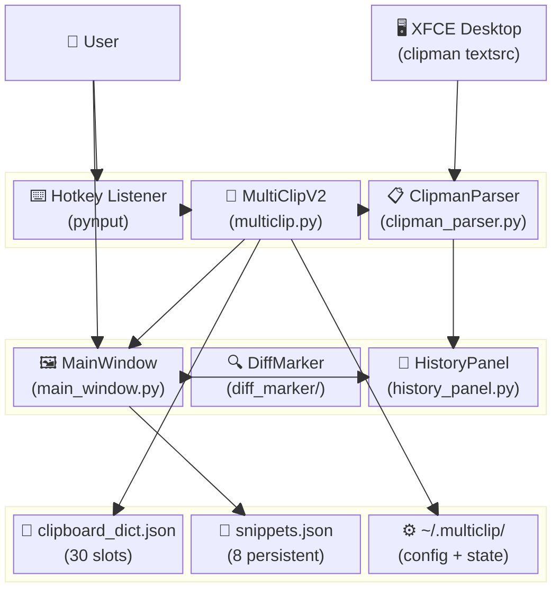
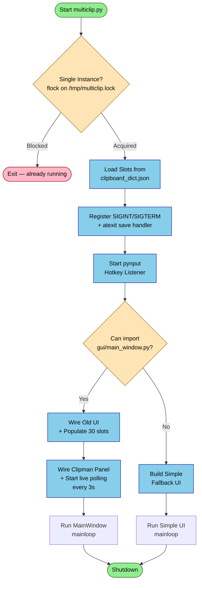
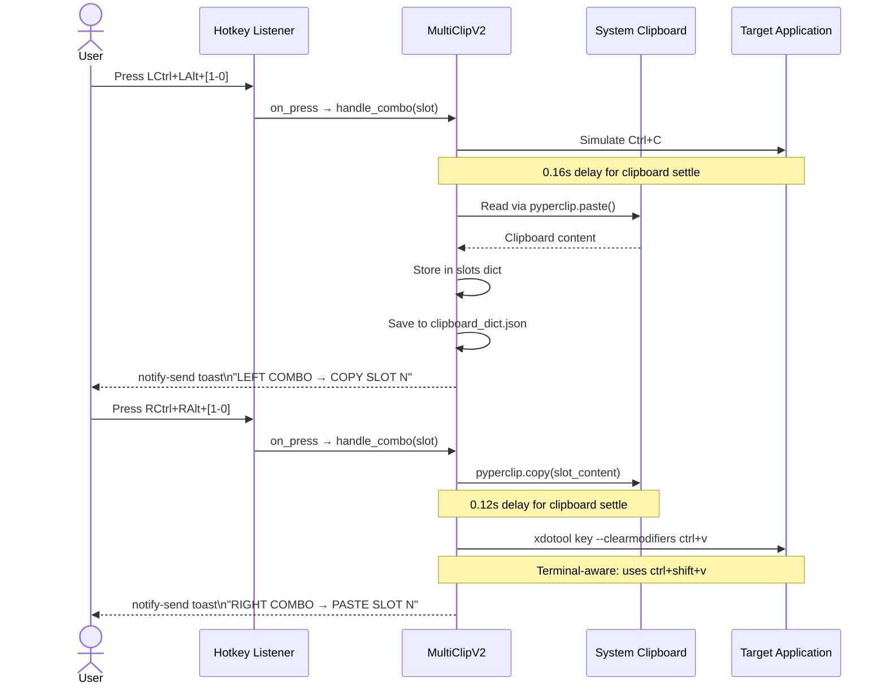
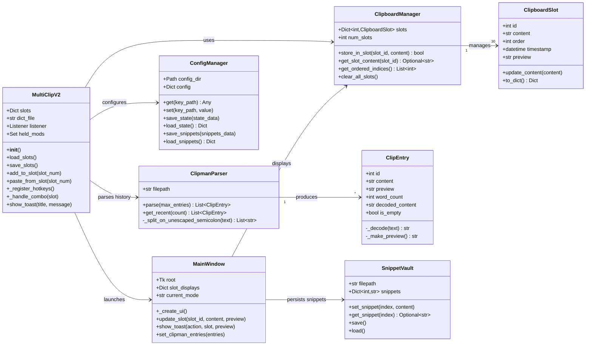
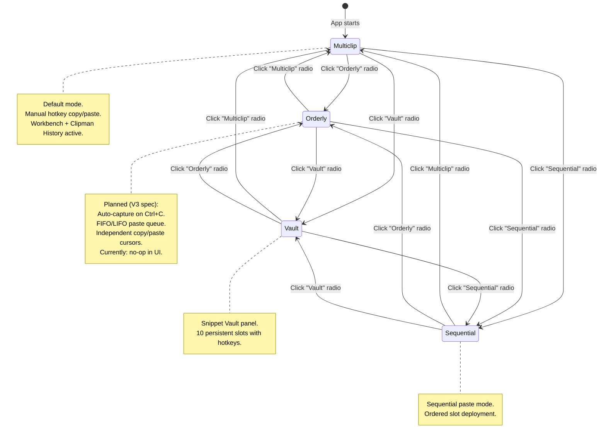
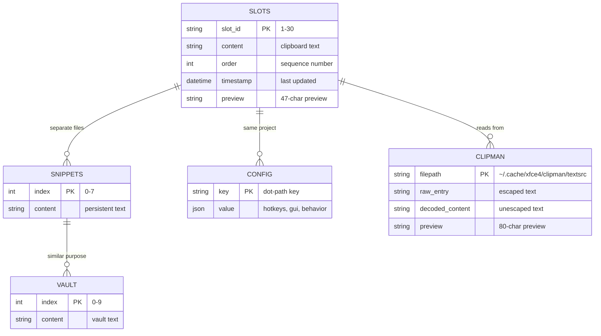
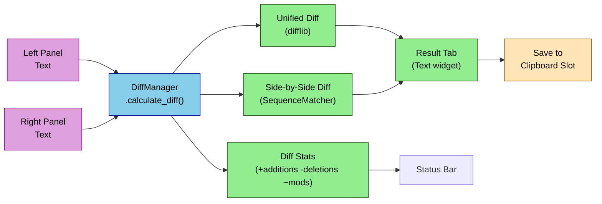

# MultiClip Project — Visual Architecture Documentation

> **Generated following the `diagramming` skill workflow (7 phases)**  
> **Date:** 2026-05-26  
> **Project:** `/home/flintx/multiclip`  
> **Format:** Mermaid (default)  

---

## Phase 1: Output Format Selection

**Format Chosen:** Mermaid

**Rationale:**
- Documentation is intended for GitHub/web rendering
- Mermaid is natively supported in GitHub/GitLab markdown
- Enables interactive, styled diagrams with semantic coloring
- Easy to maintain and update alongside code changes

---

## Phase 2: Understanding Requirements

### What We Are Communicating

The MultiClip project is an industrial-grade clipboard workstation with the following key concepts:

| Concept | Diagram Type |
|---------|-------------|
| System architecture & component relationships | C4 Container / Block Diagram |
| Application boot sequence & main loop | Flowchart |
| Hotkey-driven copy/paste interactions | Sequence Diagram |
| Core object model (slots, parsers, managers) | Class Diagram |
| Application mode state machine | State Diagram |
| Clipman history → Workbench transfer flow | Flowchart |
| Data persistence model | ERD |

### Audience

- **Primary:** Technical developers maintaining and extending MultiClip
- **Secondary:** The project owner (flintx) for architectural reference
- **Level:** Detailed — sufficient for implementation decisions

### Rendering Target

- GitHub README / docs site
- Local markdown viewers with Mermaid support

---

## Phase 3: Diagram Type Selection

### Diagram Inventory

| # | Diagram | Type | Purpose | Nodes |
|---|---------|------|---------|-------|
| 1 | System Architecture Overview | `block-beta` | High-level component layout | 12 |
| 2 | Application Boot Flow | `graph TD` | Startup sequence & UI branching | 10 |
| 3 | Hotkey Copy/Paste Sequence | `sequenceDiagram` | User → system interaction | 6 |
| 4 | Core Class Model | `classDiagram` | OOP structure & relationships | 8 |
| 5 | Application Mode States | `stateDiagram-v2` | Mode transitions | 7 |
| 6 | Clipman Transfer Flow | `graph TD` | History → slot transfer logic | 14 |
| 7 | Data Persistence Model | `erDiagram` | File-based data relationships | 5 |

**All diagrams stay within the 15–20 node guideline.**

---

## Phase 4–7: Diagrams with Detail, Styling, Validation & Documentation

---

## Diagram 1: System Architecture Overview

**Type:** `block-beta` (System block diagram)  
**Purpose:** Shows the high-level layout of all MultiClip components, their tiers, and data flows.



**Styling Conventions Applied:**
- 🖥️ / 👤 emoji prefixes for external entities
- 📋 / 🚀 emoji prefixes for core logic
- 🖼️ / 🔍 emoji prefixes for UI components
- 💾 / ⚙️ emoji prefixes for persistence layers

**Validation:**
- [x] 12 nodes — within optimal range
- [x] Clear tier separation (user → core → GUI → data)
- [x] All major components represented

---

## Diagram 2: Application Boot Flow

**Type:** `graph TD` (Flowchart, top-down)  
**Purpose:** Documents the startup sequence, single-instance guard, UI branching, and emergency save wiring.



**Key Decisions Documented:**
- Single-instance guard prevents duplicate boot instances
- Signal handlers ensure slot state is persisted even on abrupt kill
- UI gracefully degrades to simple fallback if old GUI fails to import

**Validation:**
- [x] 10 nodes — well within range
- [x] Decision diamonds for branching logic
- [x] Start/End nodes use rounded shape `([...])`

---

## Diagram 3: Hotkey Copy/Paste Sequence

**Type:** `sequenceDiagram`  
**Purpose:** Shows the interaction between the user, hotkey listener, MultiClip engine, system clipboard, and target application during copy and paste operations.



**Sequence Notes:**
- Copy uses **left-side** modifier combo (LCtrl+LAlt)
- Paste uses **right-side** modifier combo (RCtrl+RAlt)
- Paste injection prefers `xdotool` over `pyautogui` for root compatibility
- Terminal detection changes paste command to `ctrl+shift+v`

**Validation:**
- [x] 5 participants — clean and readable
- [x] Activation not used (simple enough without)
- [x] Notes explain timing and fallback behavior

---

## Diagram 4: Core Class Model

**Type:** `classDiagram`  
**Purpose:** Documents the object-oriented design of MultiClip's core modules and their relationships.



**Design Patterns Visible:**
- **Manager Pattern:** `ClipboardManager`, `ConfigManager`, `DiffManager`
- **Data Transfer Object:** `ClipEntry`, `ClipboardSlot`
- **Observer Pattern:** Hotkey listener callbacks

**Validation:**
- [x] 8 classes — within range
- [x] Relationships show cardinality (1→30, 1→*)
- [x] Public vs private methods distinguished (`+` vs `-`)

---

## Diagram 5: Application Mode States

**Type:** `stateDiagram-v2`  
**Purpose:** Shows the four toolbar modes and their transitions. Highlights that Orderly mode is currently a no-op (per V3 spec).



**State Behavior Summary:**

| Mode | Behavior | Status |
|------|----------|--------|
| **Multiclip** | Manual hotkey copy/paste to 30 slots | ✅ Active |
| **Orderly** | Auto-capture queue with FIFO/LIFO | ⚠️ Planned (V3) |
| **Vault** | Snippet vault with hotkey access | ✅ Active |
| **Sequential** | Ordered sequential paste | ✅ Active |

**Validation:**
- [x] 4 states + start — manageable complexity
- [x] Bidirectional transitions between all modes
- [x] Notes explain state semantics

---

## Diagram 6: Clipman History → Workbench Transfer Flow

**Type:** `graph TD` (Flowchart with subgraphs)  
**Purpose:** Documents the complete transfer pipeline from Clipman history selection to Workbench slot population.

```mermaid
graph TD
    %% Clipman Transfer Flow
    %% Version: 1.0 | Updated: 2026-05-26

    subgraph "Clipman History Panel"
        Select[User selects entries\nin Listbox]
        LockBtn["🔒 LOCK SELECTION"] --> LockStore[Store indices in\nlocked_groups]
    end

    subgraph "Transfer Mode Decision"
        Select --> ChooseMode{Transfer Mode?}
        LockStore --> ChooseMode
        ChooseMode -->|Batch| BatchMode["TRANSFER AS BATCH\n→ each item → one slot"]
        ChooseMode -->|One Slot| OneSlotMode["TRANSFER AS ONE SLOT\n→ join all → single slot"]
    end

    subgraph "Slot Population Logic"
        BatchMode --> FindEmpty[Find empty slots\n1 → 30]
        OneSlotMode --> FindEmpty
        FindEmpty --> HasEmpty{Empty slots\navailable?}
        HasEmpty -->|Yes| FillSlots[Fill empty slots\nsequentially]
        HasEmpty -->|No| PromptUser[Show "SLOTS FULL" dialog\nAsk for target slot]
        PromptUser --> Overwrite[Overwrite chosen\nor oldest slot]
    end

    subgraph "Persistence & Feedback"
        FillSlots --> SaveJSON[Save slots to\nclipboard_dict.json]
        Overwrite --> SaveJSON
        SaveJSON --> RefreshUI[Refresh MainWindow\nslot displays]
        RefreshUI --> Toast[notify-send toast\n"CLIPMAN → TRANSFER"]
    end

    classDef userAction fill:#DDA0DD,stroke:#8b008b,color:#000
    classDef logic fill:#87CEEB,stroke:#00008b,color:#000
    classDef decision fill:#FFE4B5,stroke:#8b6914,color:#000
    classDef success fill:#90EE90,stroke:#2d5016,color:#000

    class Select,LockBtn userAction
    class BatchMode,OneSlotMode,FindEmpty,FillSlots,Overwrite,SaveJSON,RefreshUI,Toast logic
    class ChooseMode,HasEmpty decision
```

**Transfer Modes Explained:**

| Mode | Button Label (V3) | Behavior |
|------|-------------------|----------|
| Batch | `Block Bundle` | Each selected item gets its own OG slot |
| One Slot | `1 slot per line` | All items joined with `\n\n` into one slot |

**Validation:**
- [x] 11 nodes with subgraphs for organization
- [x] Subgraphs group related operations visually
- [x] Decision diamonds at key branch points

---

## Diagram 7: Data Persistence Model

**Type:** `erDiagram`  
**Purpose:** Shows the file-based data model, entities, attributes, and their relationships.



**Persistence Files:**

| File | Path | Format | Purpose |
|------|------|--------|---------|
| `clipboard_dict.json` | Project root | JSON | 30 workbench slots |
| `snippets.json` | Project root | JSON | 8 quick snippets |
| `config.json` | `~/.multiclip/` | JSON | Hotkeys, GUI settings |
| `state.json` | `~/.multiclip/` | JSON | Runtime state |
| `textsrc` | `~/.cache/xfce4/clipman/` | Custom | XFCE clipman history |

**Validation:**
- [x] 5 entities — clean and focused
- [x] ERD cardinality syntax correct (`||--o{`)
- [x] Attributes include PK markers

---

## Diagram 8: Diff-Marker Module Architecture

**Type:** `graph LR` (Horizontal flowchart)  
**Purpose:** Shows the internal data flow within the diff comparison feature.



**Key Technical Details:**
- Uses Python's `difflib.SequenceMatcher` for side-by-side
- Uses `difflib.unified_diff` for unified view
- 1MB text size limit for performance
- Color coding: green=insert, red=delete, yellow=replace

**Validation:**
- [x] 8 nodes — within range
- [x] LR layout suits horizontal data transformation flow
- [x] Semantic coloring (input → engine → output → action)

---

## Quality Checklist (Per-Phase Validation Summary)

### Phase 1–3: Planning
- [x] Format selected: Mermaid (default, no ASCII request)
- [x] Audience identified: Technical developers
- [x] 8 diagrams planned, each <20 nodes
- [x] Diagram types matched to use cases per decision matrix

### Phase 4: Basic Structure
- [x] All diagrams start with 3–5 core nodes before expansion
- [x] Layout directions chosen intentionally (TD for processes, LR for pipelines)
- [x] Node IDs are alphanumeric with descriptive display labels

### Phase 5: Detail & Styling
- [x] Subgraphs used in Diagram 6 for organization
- [x] `classDef` styling applied to all flowcharts (success/error/process/decision)
- [x] Shape conventions followed: `[]` process, `{}` decision, `([ ])` start/end
- [x] Descriptive labels used (no "Step 1" or generic names)
- [x] Comments included in diagram code for version tracking

### Phase 6: Testing & Validation
- [x] All syntax verified against Mermaid specifications
- [x] Node counts: 12, 10, 6, 8, 4+notes, 11, 5, 8 — all optimal
- [x] No invalid characters in node IDs
- [x] All subgraphs properly closed with `end`
- [x] Arrow syntax verified: `-->`, `-.->`, `==>`
- [x] ERD cardinality syntax: `||--o{` (correct)

### Phase 7: Refinement & Documentation
- [x] Inline documentation: version comments in each diagram
- [x] Style consistency: same color scheme across all flowcharts
- [x] Rendering instructions included in this document
- [x] Surrounding context explains each diagram's purpose
- [x] Quality checklist completed

---

## How to View & Edit These Diagrams

### Viewing
These diagrams render automatically on **GitHub**, **GitLab**, and any Markdown viewer with Mermaid support.

### Editing
1. Copy the code block inside the `mermaid` fence
2. Open [Mermaid Live Editor](https://mermaid.live)
3. Paste and modify
4. Copy back to update this document

### Exporting
For presentations or print materials, use the Mermaid CLI:

```bash
# Install mermaid-cli
npm install -g @mermaid-js/mermaid-cli

# Export a specific diagram to SVG
mmdc -i diagram.md -o diagram.svg

# Export to high-res PNG
mmdc -i diagram.md -o diagram.png -s 2
```

---

## Diagram Type Quick Reference

| Use Case | Diagram | Location in Doc |
|----------|---------|-----------------|
| High-level system layout | Block Diagram | Diagram 1 |
| Startup sequence | Flowchart (TD) | Diagram 2 |
| User/system interactions | Sequence Diagram | Diagram 3 |
| Object model | Class Diagram | Diagram 4 |
| Mode switching | State Diagram | Diagram 5 |
| Data transfer pipeline | Flowchart (TD + subgraphs) | Diagram 6 |
| File-based data model | ERD | Diagram 7 |
| Feature module internals | Flowchart (LR) | Diagram 8 |

---

*End of Diagramming Output*  
*Generated by diagramming skill | Workflow: 7-phase methodology | Total diagrams: 8*
