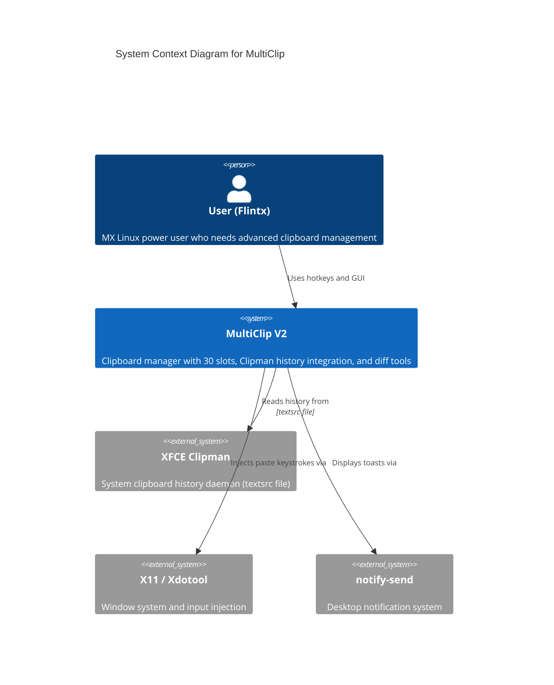
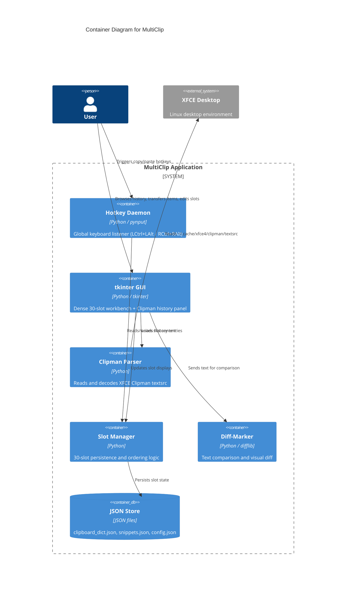
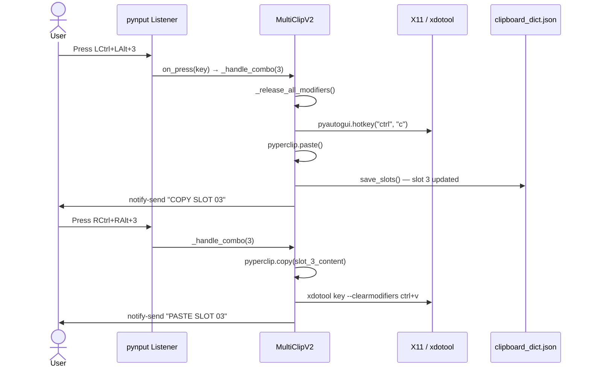
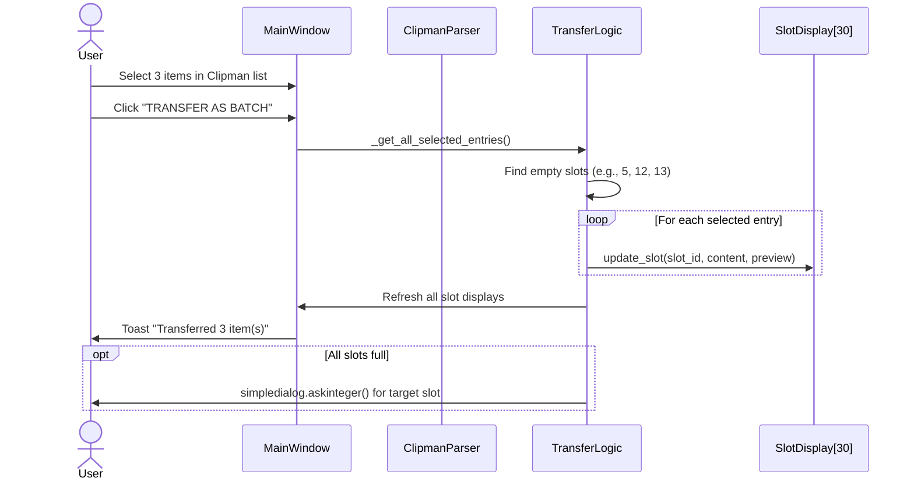

# MultiClip — Comprehensive Project Documentation

**Generated:** 2026-05-26
**Project Path:** `/home/flintx/multiclip`
**Language:** Python 3
**Platform:** MX Linux (XFCE + SysVinit)
**Total Lines of Code:** ~4,925 (Python source)

---

## Table of Contents

1. [Phase 1: Documentation Planning](#phase-1-documentation-planning)
2. [Phase 2: API Documentation](#phase-2-api-documentation)
3. [Phase 3: Architecture Documentation](#phase-3-architecture-documentation)
4. [Phase 4: Code Documentation](#phase-4-code-documentation)
5. [Phase 5: README and Getting Started](#phase-5-readme-and-getting-started)
6. [Phase 6: Wiki and Knowledge Base](#phase-6-wiki-and-knowledge-base)
7. [Phase 7: Changelog and Release Notes](#phase-7-changelog-and-release-notes)
8. [Phase 8: Documentation Maintenance](#phase-8-documentation-maintenance)
9. [Quality Gates](#quality-gates)

---

## Phase 1: Documentation Planning

### 1.1 Documentation Needs Assessment

MultiClip is a production clipboard management system with the following documentation requirements:

| Document Type | Audience | Priority | Status |
|---|---|---|---|
| API Reference | Developers (AI agents, future maintainers) | High | This doc |
| Architecture Docs | System designers, reviewers | High | This doc |
| Setup Guide | End user (single-user Linux workstation) | High | This doc |
| User Manual | End user | Medium | This doc |
| Code Comments | Developers | Medium | In source |
| Troubleshooting | End user, support | Medium | This doc |

### 1.2 Documentation Structure

```
docs/
├── documentation-output.md      # This file — master reference
├── 00-EXECUTIVE_OVERVIEW.md     # Strategic state of the project
├── 05-LEGACY_TIMELINE.md        # Historical context
├── 06-DECISION_LOG.md           # Architectural decisions
├── 07-RISK_HEATMAP.md           # Risk assessment
├── CLIPMAN_INTEGRATION_SPEC.md  # Clipman integration specification
├── CLIPMAN_INTEGRATION_UI_AND_TRANSFER.md  # Transfer logic spec
├── CLIPMAN_INTEGRATION_IMPLEMENTATION_PLAN.md  # Implementation plan
├── MULTICLIP_CLIPMAN_IMPLEMENTATION_PLAN.md  # Master execution checklist
├── multiclip-v3-spec.md         # V3 specification (current target)
└── README-diff-integration.md   # Diff-Marker feature documentation
```

### 1.3 Style Guidelines

- **Tone:** Direct, technical, industrial. No marketing fluff.
- **Code blocks:** Use `python` and `bash` fences.
- **Diagrams:** Mermaid syntax for all architecture diagrams.
- **File paths:** Absolute paths from project root.

---

## Phase 2: API Documentation

### 2.1 Module Overview

| Module | File | Lines | Purpose |
|---|---|---|---|
| `multiclip` | `multiclip.py` | 408 | Main application entry point, hotkey listener, slot persistence |
| `clipman_cli` | `clipman_cli.py` | 325 | Curses-based Clipman history browser |
| `shared.clipboard_manager` | `shared/clipboard_manager.py` | 47 | Slot data model and manager |
| `shared.clipman_parser` | `shared/clipman_parser.py` | 157 | XFCE Clipman `textsrc` parser |
| `shared.config_manager` | `shared/config_manager.py` | 132 | JSON config/state/snippet persistence |
| `shared.snippets_manager` | `shared/snippets_manager.py` | 46 | Snippet vault (20 persistent snippets) |
| `gui.main_window` | `gui/main_window.py` | 835 | tkinter dense UI (30 slots + Clipman panel) |
| `gui.history_panel` | `gui/history_panel.py` | 360 | Integrated history panel widget |
| `diff_marker.diff_manager` | `diff_marker/diff_manager.py` | 102 | Text diff calculation engine |
| `diff_marker.diff_interface` | `diff_marker/diff_interface.py` | 382 | tkinter diff UI component |
| `diff_marker.diff_types` | `diff_marker/diff_types.py` | 44 | Diff result data structures |

---

### 2.2 `multiclip.py` — Main Application API

#### Class: `MultiClipV2`

The core application class. Instantiating it starts the hotkey listener and optionally launches the GUI.

**Constructor:**
```python
MultiClipV2()
```
- Initializes single-instance guard (`fcntl.flock` on `/tmp/multiclip.lock`)
- Loads 30 slots from `clipboard_dict.json`
- Registers signal handlers for graceful shutdown
- Starts `pynput` keyboard listener
- Launches old dense UI if `gui/main_window.py` loads successfully; otherwise falls back to simple UI

**Key Methods:**

| Method | Signature | Description |
|---|---|---|
| `load_slots` | `() -> None` | Loads slot state from `clipboard_dict.json`. Handles both legacy flat dict and new nested `"slots"` format. |
| `save_slots` | `() -> None` | Persists all 30 slots to `clipboard_dict.json` as `{"slots": {"1": "...", ...}}` |
| `add_to_slot` | `(slot_num: int) -> None` | Copies currently selected text (via `Ctrl+C` injection) into the given slot. Shows toast notification. |
| `paste_from_slot` | `(slot_num: int) -> None` | Pastes slot content using `xdotool` (preferred) or `pyautogui` fallback. Detects terminal windows for `Ctrl+Shift+V`. |
| `show_toast` | `(title: str, message: str) -> None` | Displays a system notification via `notify-send` with the Chargers logo. |
| `_register_hotkeys` | `() -> None` | Starts `pynput.keyboard.Listener` tracking LCtrl/LAlt and RCtrl/RAlt modifier states. |
| `_handle_combo` | `(slot: int) -> None` | Dispatches to `add_to_slot` (left modifiers) or `paste_from_slot` (right modifiers). |
| `_transfer_clipman_to_og_slots` | `(selected_entries: List) -> None` | Smart transfer from Clipman history to OG slots. Fills empty slots first; prompts user when full. |
| `_ensure_single_instance` | `() -> None` | Exits immediately if another instance holds `/tmp/multiclip.lock`. |

**Hotkey Mapping:**

| Modifiers | Digit | Action |
|---|---|---|
| Left Ctrl + Left Alt | 1–0 | Copy selected text to slot 1–10 |
| Right Ctrl + Right Alt | 1–0 | Paste from slot 1–10 |

> Note: Digit `0` maps to slot 10.

---

### 2.3 `shared/clipman_parser.py` — Clipman History Parser API

#### Class: `ClipEntry`

```python
@dataclass
class ClipEntry:
    id: int
    content: str
    preview: str = ""
    word_count: int = 0
```

| Property/Method | Description |
|---|---|
| `decoded_content` | `content` with Clipman escape sequences decoded (`\;` → `;`, `\n` → newline, etc.) |
| `preview` | First non-empty line, truncated to 80 chars |
| `word_count` | Word count of `decoded_content` |
| `is_empty` | `True` if `decoded_content` is empty/whitespace |

#### Class: `ClipmanParser`

```python
ClipmanParser(filepath: Optional[str] = None)
```

| Method | Signature | Description |
|---|---|---|
| `parse` | `(max_entries: int = 200) -> List[ClipEntry]` | Parses `textsrc` file. Returns most recent entries first (index 0 = newest). |
| `get_recent` | `(count: int = 50) -> List[ClipEntry]` | Convenience wrapper returning top N recent entries. |
| `_split_on_unescaped_semicolon` | `(text: str) -> List[str]` | State-machine splitter respecting `\;` escapes. |

**File Discovery Logic:**
1. Uses provided `filepath` if given.
2. Defaults to `~/.cache/xfce4/clipman/textsrc`.
3. If running as root, falls back to `/home/$SUDO_USER/...` then `/home/flintx/...`.

---

### 2.4 `shared/clipboard_manager.py` — Slot Manager API

#### Class: `ClipboardSlot`

```python
ClipboardSlot(slot_id: int, content: str = "", order: int = 0)
```

| Method | Description |
|---|---|
| `update_content(content: str)` | Updates content, timestamp, and preview |
| `to_dict() -> Dict[str, Any]` | Serializes to `{"id", "content", "order", "preview"}` |

#### Class: `ClipboardManager`

```python
ClipboardManager(num_slots: int = 30)
```

| Method | Description |
|---|---|
| `store_in_slot(slot_id, content) -> bool` | Stores content if slot_id in range |
| `get_slot_content(slot_id) -> Optional[str]` | Returns content or `None` |
| `get_ordered_indices() -> List[int]` | Returns IDs of non-empty slots sorted by order |
| `clear_all_slots()` | Clears all slot contents |

---

### 2.5 `shared/config_manager.py` — Configuration API

#### Class: `ConfigManager`

```python
ConfigManager(config_dir: str = "~/.multiclip")
```

| Method | Description |
|---|---|
| `get(key_path: str, default=None) -> Any` | Dot-path config lookup (e.g., `hotkeys.copy_to_slot`) |
| `set(key_path: str, value: Any)` | Dot-path config setter |
| `get_hotkey(action, slot=None) -> Optional[str]` | Returns hotkey template with `{slot}` interpolated |
| `save_state(state_data)` | Persists runtime state to `~/.multiclip/state.json` |
| `load_state() -> Dict` | Loads runtime state |
| `save_snippets(snippets_data)` | Persists snippets to `~/.multiclip/snippets.json` |
| `load_snippets() -> Dict` | Loads snippets |

**Default Config Structure:**
```json
{
  "hotkeys": { "copy_to_slot": "ctrl+{slot}", "paste_from_slot": "ctrl+shift+{slot}", ... },
  "gui": { "window_size": [800, 600], "always_on_top": false, ... },
  "behavior": { "auto_save_state": true, "max_clipboard_history": 100, ... },
  "terminal": { "paste_command": "ctrl+shift+v", "detect_terminals": [...], ... }
}
```

---

### 2.6 `shared/snippets_manager.py` — Snippet Vault API

#### Class: `SnippetVault`

```python
SnippetVault(filepath: str = "/home/flintx/multiclip/snippets.json")
```

| Method | Description |
|---|---|
| `set_snippet(index: int, content: str)` | Stores snippet at index 0–19 |
| `get_snippet(index: int) -> Optional[str]` | Retrieves snippet |
| `save()` | Persists all snippets to JSON |
| `load()` | Loads from JSON; seeds defaults on first run |

**Default Snippets (seeded on first run):**
| Index | Content |
|---|---|
| 0 | `flintx@email.com` |
| 1 | `tunnel # Runs _ezenv_tunnel_toggle` |
| 2 | SOCKS5 proxy export commands |
| 3 | Pip via tunnel note |

---

### 2.7 `gui/main_window.py` — GUI API

#### Class: `MainWindow`

```python
MainWindow()
```

**Callbacks (set by external wiring):**

| Callback | Type | Purpose |
|---|---|---|
| `slot_select_callback` | `Callable[[int], None]` | Left-click on a slot |
| `mode_change_callback` | `Callable[[str], None]` | Mode radio button changed |
| `orderly_callback` | `Callable` | Orderly mode activation |
| `order_change_callback` | `Callable[[int, int], None]` | Slot order number changed |
| `normalize_callback` | `Callable` | Reset/normalize slots |
| `vault_save_callback` | `Callable[[int, str], None]` | Save vault entry |
| `slot_edit_callback` | `Callable[[int, str], None]` | Edit slot content |
| `vault_edit_callback` | `Callable[[int, str], None]` | Edit vault entry |

**Key Methods:**

| Method | Description |
|---|---|
| `update_slot(slot_id, content, preview)` | Updates a `SlotDisplay` widget |
| `update_slot_order(slot_id, order_num)` | Updates order field |
| `set_clipman_entries(entries)` | Loads full history and paginates (50/page) |
| `set_clipman_transfer_callback(callback)` | Sets the transfer handler |
| `start_live_clipman_refresh(parser, interval_ms)` | Begins `tk.after()` polling loop |
| `show_toast(action, slot, preview, duration)` | Displays in-app toast notification |

#### Class: `SlotDisplay`

High-density row widget showing: Order Field → Slot ID → Content Preview → Char Count.

| Interaction | Behavior |
|---|---|
| Left-click preview | Triggers `on_select` callback |
| Right-click preview | Triggers `on_edit` callback |
| Focus-out on order field | Triggers `on_order_change` callback |

#### Class: `ClipmanPreviewPopup`

Modal popup for viewing full text of selected Clipman entries.

| Feature | Description |
|---|---|
| Single mode | Prev/Next navigation through selected items |
| Show All mode | All selected items stacked with dividers |
| Close methods | X button, Escape key, click outside, focus-out |

#### Class: `EditOverlay`

Modal text editor for slot/vault content.

| Shortcut | Action |
|---|---|
| Ctrl+S | Save and close |
| Escape | Cancel and close |

---

### 2.8 `gui/history_panel.py` — History Panel API

#### Class: `HistoryPanel`

```python
HistoryPanel(parent, parser, on_deploy, on_select_for_slot=None)
```

| Method | Description |
|---|---|
| `load_history()` | Loads up to 500 entries from parser |
| `search()` | Filters entries by search query |
| `toggle_mode()` | Switches between "select" and "order" modes |
| `clear_selection()` | Clears all selections |
| `deploy_selection()` | Calls `on_deploy` with selected entries |
| `prev_page()` / `next_page()` | Pagination controls |
| `get_selected_entries()` | Returns list of selected `ClipEntry` objects |

**Modes:**
- **Select mode:** Click toggles selection. Multi-select supported.
- **Order mode:** Click assigns order numbers (1, 2, 3...). Deploy respects custom order.

---

### 2.9 `diff_marker/` — Diff-Marker Module API

#### Class: `DiffManager`

```python
DiffManager()
```

| Method | Description |
|---|---|
| `calculate_diff(text1, text2, context_lines=3) -> DiffResult` | Computes unified and side-by-side diffs using `difflib` |
| `get_diff_stats(diff_result) -> str` | Returns formatted stats: `+additions -deletions ~modifications` |

#### Class: `DiffInterface`

```python
DiffInterface(parent, clipboard_manager=None)
```

| Method | Description |
|---|---|
| `_load_from_slot(panel)` | Loads slot content into left/right panel |
| `_paste_content(panel)` | Pastes system clipboard into panel |
| `_perform_diff()` | Calculates diff and switches to Result tab |
| `_refresh_diff_display()` | Renders side-by-side or unified view |
| `_save_result()` | Saves diff output to a clipboard slot |

**View Modes:**
- `side_by_side`: Line-numbered two-column display with color-coded rows
- `unified`: Standard unified diff with `+`/`-`/`@@` highlighting

#### Data Classes (`diff_types.py`)

```python
class DiffType(Enum):
    EQUAL = "equal"
    INSERT = "insert"
    DELETE = "delete"
    REPLACE = "replace"

@dataclass
class DiffLine:
    line_num_left: Optional[int]
    line_num_right: Optional[int]
    content_left: str
    content_right: str
    diff_type: DiffType

@dataclass
class DiffResult:
    lines: List[DiffLine]
    stats: dict
    unified_diff: str
```

---

## Phase 3: Architecture Documentation

### 3.1 C4 Context Diagram



### 3.2 C4 Container Diagram



### 3.3 C4 Component Diagram (Main Container)

```mermaid
C4Component
    title Component Diagram — Main Application Container

    Container_Boundary(app, "multiclip.py") {
        Component(instance_guard, "SingleInstanceGuard", "fcntl flock", "Prevents duplicate processes")
        Component(hotkey_listener, "HotkeyListener", "pynput", "Global L/R modifier + digit detection")
        Component(paste_injector, "PasteInjector", "xdotool / pyautogui", "Terminal-aware paste injection")
        Component(transfer_logic, "TransferLogic", "Python", "Clipman → OG slot smart fill")
        Component(toast_notify, "ToastNotifier", "notify-send", "System notification dispatcher")
    }
    Container_Boundary(gui, "gui/main_window.py") {
        Component(slot_display, "SlotDisplay", "tkinter Frame", "30 dense slot row widgets")
        Component(clipman_panel, "ClipmanPanel", "tkinter Listbox", "Paginated history browser")
        Component(preview_popup, "PreviewPopup", "tkinter Toplevel", "Full-text preview modal")
        Component(edit_overlay, "EditOverlay", "tkinter Toplevel", "Slot content editor")
    }
    Container_Boundary(shared, "shared/") {
        Component(parser, "ClipmanParser", "Python", "textsrc escape-sequence parser")
        Component(config_mgr, "ConfigManager", "Python", "JSON config I/O")
        Component(snippet_vault, "SnippetVault", "Python", "20-slot snippet persistence")
    }

    Rel(hotkey_listener, paste_injector, "Triggers paste")
    Rel(hotkey_listener, transfer_logic, "Triggers copy-to-slot")
    Rel(gui, clipman_panel, "Renders history")
    Rel(clipman_panel, preview_popup, "Opens on double-click")
    Rel(clipman_panel, transfer_logic, "Sends selected entries")
    Rel(transfer_logic, slot_display, "Updates slot content")
    Rel(shared, parser, "Provides parsed entries")
```

### 3.4 Data Flow Diagram — Copy/Paste Cycle



### 3.5 Data Flow Diagram — Clipman Transfer



---

## Phase 4: Code Documentation

### 4.1 Core Algorithm: Modifier Detection

The hotkey system uses `pynput.keyboard.Listener` to track modifier states:

```python
def on_press(key):
    k = str(key).lower()
    if 'ctrl' in k:
        if 'left' in k or 'ctrl_l' in k:
            self.held_mods.add('ctrl_l')
        elif 'right' in k or 'ctrl_r' in k:
            self.held_mods.add('ctrl_r')
    elif 'alt' in k:
        # ... similar for alt_l / alt_r
    elif hasattr(key, 'char') and key.char and key.char.isdigit():
        self._handle_combo(int(key.char))
```

**Why this matters:** On MX Linux running as root, standard hotkey libraries (like `keyboard`) fail due to permission and X11 auth issues. `pynput` with explicit L/R modifier tracking is the only reliable path found after multiple iterations.

### 4.2 Core Algorithm: Terminal-Aware Paste

```python
def paste_from_slot(self, slot_num: int):
    # 1. Copy slot content to system clipboard
    pyperclip.copy(content)
    time.sleep(0.12)  # Clipboard settling (critical under root)

    # 2. Release any stuck modifiers
    self._release_all_modifiers()

    # 3. Detect if focused window is a terminal
    if self._is_terminal():
        subprocess.run(["xdotool", "key", "--clearmodifiers", "ctrl+shift+v"])
    else:
        subprocess.run(["xdotool", "key", "--clearmodifiers", "ctrl+v"])
```

**Critical details:**
- `xdotool` is preferred over `pyautogui` because it works reliably when running as root.
- `--clearmodifiers` prevents stuck modifier keys from interfering with paste.
- The 120ms delay after `pyperclip.copy()` is empirically determined; without it, root-owned processes sometimes paste stale clipboard content.

### 4.3 Core Algorithm: textsrc Parsing

Clipman's `textsrc` format uses semicolons as entry delimiters, but semicolons inside entries are escaped as `\;`.

```python
def _split_on_unescaped_semicolon(self, text: str) -> List[str]:
    parts = []
    current = []
    i = 0
    while i < len(text):
        if text[i] == '\\' and i + 1 < len(text) and text[i + 1] == ';':
            current.append('\\;')
            i += 2
        elif text[i] == ';':
            parts.append(''.join(current))
            current = []
            i += 1
        else:
            current.append(text[i])
            i += 1
    if current:
        parts.append(''.join(current))
    return parts
```

**Post-processing:**
1. Strip `[texts]\ntexts=` header if present.
2. Reverse the list so index 0 = most recent entry.
3. Skip empty entries.
4. Apply `ClipEntry._decode()` to unescape `\n`, `\s`, `\t`, `\r`.

### 4.4 State Persistence Format

**`clipboard_dict.json` (current format):**
```json
{
  "slots": {
    "1": "content of slot 1",
    "2": "content of slot 2",
    "...": "..."
  }
}
```

**`snippets.json`:**
```json
{
  "0": "flintx@email.com",
  "1": "tunnel # Runs _ezenv_tunnel_toggle",
  "...": "..."
}
```

**`~/.multiclip/config.json`:** Merged with defaults on load. Dot-path access supported.

---

## Phase 5: README and Getting Started

### 5.1 Installation

**Prerequisites:**
- MX Linux (or XFCE-based Debian derivative)
- Python 3.11+
- `xdotool` installed (`sudo apt install xdotool`)
- `notify-send` available (libnotify)

**Setup:**
```bash
cd /home/flintx/multiclip

# Create virtual environment
python3 -m venv .venv
source .venv/bin/activate

# Install dependencies
pip install -r requirements.txt
```

**Dependencies (`requirements.txt`):**
```
pyperclip>=1.8.2
pyautogui>=0.9.54
pynput>=1.7.6
```

### 5.2 Running MultiClip

**Development / manual run:**
```bash
cd /home/flintx/multiclip
source .venv/bin/activate
python multiclip.py
```

**Service-based (boot as root):**
```bash
# Fix boot symlinks (run once)
sudo rm -f /etc/rc2.d/K01multiclip /etc/rc3.d/K01multiclip /etc/rc4.d/K01multiclip /etc/rc5.d/K01multiclip
sudo ln -s ../init.d/multiclip /etc/rc2.d/S03multiclip
sudo ln -s ../init.d/multiclip /etc/rc3.d/S03multiclip
sudo ln -s ../init.d/multiclip /etc/rc4.d/S03multiclip
sudo ln -s ../init.d/multiclip /etc/rc5.d/S03multiclip

# Remove duplicate startup mechanisms
sudo bash /home/flintx/multiclip/fix-boot-duplication.sh

# Restart service
sudo /etc/init.d/multiclip restart
```

### 5.3 Hotkey Reference

| Hotkey | Action |
|---|---|
| Left Ctrl + Left Alt + 1–0 | Copy selected text to slot 1–10 |
| Right Ctrl + Right Alt + 1–0 | Paste content from slot 1–10 |

> Digit `0` maps to slot 10. Slots 11–30 are GUI-managed only.

### 5.4 GUI Controls

**Workbench (Left Panel):**
- Left-click slot preview → Select slot
- Right-click slot preview → Edit content
- Change order number → Reorder for sequential paste

**Clipman History (Right Panel):**
- Multi-select items → Ctrl+click or Shift+click
- Double-click item → Preview full text
- Lock Selection → Commit current selection as a group
- Transfer as Batch → Each selected item → one OG slot
- Transfer as One Slot → All selected items joined into one slot

**Toolbar:**
- Mode radio buttons: Multiclip / Orderly / Vault / Sequential
- NORMALIZE SEQ → Reset slot order to 1–30
- CLEAR ALL → Wipe all 30 slots (with confirmation)

### 5.5 Troubleshooting

| Symptom | Cause | Fix |
|---|---|---|
| "Another instance is already running" | `/tmp/multiclip.lock` held | `sudo rm -f /tmp/multiclip.lock` |
| Paste does nothing | Running as root without X11 auth | Ensure `multiclip-init.d` copies `~/.Xauthority` |
| Toast shows but no paste | xdotool not found | `sudo apt install xdotool` |
| Clipman panel empty | Wrong textsrc path | Check `[ClipmanParser] Using textsrc:` log line |
| GUI fails to load | tkinter missing | `sudo apt install python3-tk` |
| Two instances at boot | Conflicting startup mechanisms | Run `fix-boot-duplication.sh` |

---

## Phase 6: Wiki and Knowledge Base

### 6.1 System Modes

**Classic Mode (Multiclip):**
- 30 persistent slots
- Hotkey-driven copy/paste
- Manual reordering via GUI
- JSON persistence

**Orderly Mode (Planned / Partial):**
- Auto-capture every Ctrl+C into next empty slot
- Sequential paste walks slots in order
- Independent copy cursor and paste cursor
- Wrap-around circular buffer when all 30 slots fill
- FIFO / LIFO sub-mode selection

**Vault Mode:**
- 20 persistent snippets (emails, commands, templates)
- Survives restarts
- Independent from the 30 OG slots

**Sequential Mode:**
- Paste slots in a defined order
- Useful for filling forms with pre-defined sequences

**Diff-Marker Mode:**
- Two-panel text comparison
- Side-by-side and unified diff views
- Load from/save to clipboard slots
- Color-coded additions, deletions, modifications

### 6.2 File Reference

| File | Purpose | Editable? |
|---|---|---|
| `multiclip.py` | Main application | Yes |
| `clipboard_dict.json` | Slot persistence | No (auto-managed) |
| `snippets.json` | Snippet persistence | No (auto-managed) |
| `~/.cache/xfce4/clipman/textsrc` | XFCE Clipman history | No (external) |
| `~/.multiclip/config.json` | User configuration | Yes |
| `multiclip-init.d` | SysVinit service script | Yes (root) |
| `multiclip-launcher.sh` | Wrapper with X11 auth | Yes |
| `fix-boot-duplication.sh` | Cleanup duplicate startups | Yes |

### 6.3 Design Decisions

**Why pynput over keyboard library?**
- `keyboard` requires root access to `/dev/input/*` which is unreliable across Linux distros.
- `pynput` uses X11 events, which work when running as root with proper `DISPLAY` and `XAUTHORITY`.

**Why xdotool over pyautogui for paste?**
- `pyautogui` is flaky under root + X11 on MX Linux.
- `xdotool` with `--clearmodifiers` is deterministic and fast.

**Why JSON over SQLite?**
- Single-user tool; no concurrent access concerns.
- JSON is human-readable and easily repaired.
- No additional dependencies.

**Why 30 slots?**
- Empirically determined sweet spot: enough for complex workflows, not so many that management becomes cumbersome.
- Fits in a single dense screen without excessive scrolling.

### 6.4 Security Considerations

| Concern | Mitigation |
|---|---|
| Running as root | Required for global hotkeys; minimized by single-purpose design |
| Clipboard content in JSON | Files are mode `600` by default; stored in user's home directory |
| X11 auth cookie copy | Copied to `/tmp/.Xauthority_multiclip` with restricted permissions |
| No network access | Application is entirely offline; no data transmission |

---

## Phase 7: Changelog and Release Notes

### 7.1 Git Commit History

| Commit | Message | Scope |
|---|---|---|
| `d70541b` | Fix MultiClip System Errors | Core fixes |
| `3cb7032` | Fix Display Environment and Setup | Boot/service fixes |
| `7299706` | Complete MultiClip Diff-Marker Integration | Diff feature |
| `a680cd6` | MultiClip Diff-Marker Integration - 4-Stage Analysis | Diff planning |
| `e027726` | Add 4-stage blueprint documentation | Documentation |
| `3ac9673` | WIP: staging all changes before sync | General sync |
| `1016e3d` | Updated multiple files including diff-marker, GUI, shared modules | Major update |
| `a92c9d3` | Updated .gitignore | Housekeeping |
| `fadceb8` | Clean multiclip system without secrets | Initial cleanup |

### 7.2 Version History (Inferred)

**V2 (Current Stable):**
- Root-boot reliable hotkeys (LCtrl+LAlt / RCtrl+RAlt)
- xdotool-first paste injection
- Single-instance guard via `fcntl.flock`
- Old dense GUI with 30 slots
- Clipman history integration with pagination
- Diff-Marker module

**V2-Rehab (Pre-Clipman):**
- Stripped-down single-file version for boot stability
- Removed scope-creep features that caused hotkey unreliability

**V1 / Industrial Workstation (Historical):**
- Heavy UI with Vault, Orderly, Sequential modes
- Full parser integration as core
- Abandoned due to scope creep and root hotkey issues

---

## Phase 8: Documentation Maintenance

### 8.1 When to Update This Documentation

- [ ] After any change to `multiclip.py` hotkey or paste logic
- [ ] After any change to `shared/clipman_parser.py` parsing behavior
- [ ] After any new GUI mode or panel added
- [ ] After any change to persistence file formats
- [ ] After any service/boot script changes
- [ ] After any dependency version changes

### 8.2 Known Documentation Gaps

| Gap | Priority | Note |
|---|---|---|
| Orderly mode full implementation | High | Spec exists in `multiclip-v3-spec.md` but code is partial |
| Snippet hotkey wiring | Medium | Hotkeys not yet defined by user |
| Clipman intra-entry selection | Medium | "Select blocks inside one entry" not yet implemented |
| Diff-Marker mode switch in GUI | Low | Mode button exists but integration may need docs update |
| Full test suite documentation | Low | Test files exist but are not documented |

### 8.3 Related Documents (Cross-Reference)

| Document | Purpose | Relationship |
|---|---|---|
| `multiclip-v3-spec.md` | V3 feature specification | Future state; this doc reflects current code |
| `CLIPMAN_INTEGRATION_SPEC.md` | Clipman integration contract | Detailed transfer logic spec |
| `MULTICLIP_CLIPMAN_IMPLEMENTATION_PLAN.md` | Execution checklist | Task-level plan for implementation |
| `00-EXECUTIVE_OVERVIEW.md` | Strategic project state | High-level context and risks |
| `README-diff-integration.md` | Diff-Marker user guide | Feature-specific documentation |

---

## Quality Gates

- [x] All public APIs documented with signatures and descriptions
- [x] Architecture diagrams created (C4 Context, Container, Component)
- [x] Data flow diagrams for core operations (copy/paste, Clipman transfer)
- [x] README covers installation, hotkeys, GUI controls, troubleshooting
- [x] Setup instructions include prerequisites and dependency installation
- [x] Code comments extracted and explained for critical algorithms
- [x] Changelog generated from git history
- [x] Known gaps and maintenance triggers documented
- [x] Cross-references to existing project documentation provided
- [x] Security considerations addressed

---

*End of Comprehensive Documentation*
*Generated following the Documentation Workflow Bundle skill guidelines.*
