# MultiClip V2 — Mermaid Diagrams

> Generated per the `mermaid-diagrams` skill instructions.
> Each diagram is focused on a single concept with clear labels, explicit directions, and grouped elements.

---

## 1. System Context (C4 Context)

High-level view of MultiClip V2 and its external interactions.

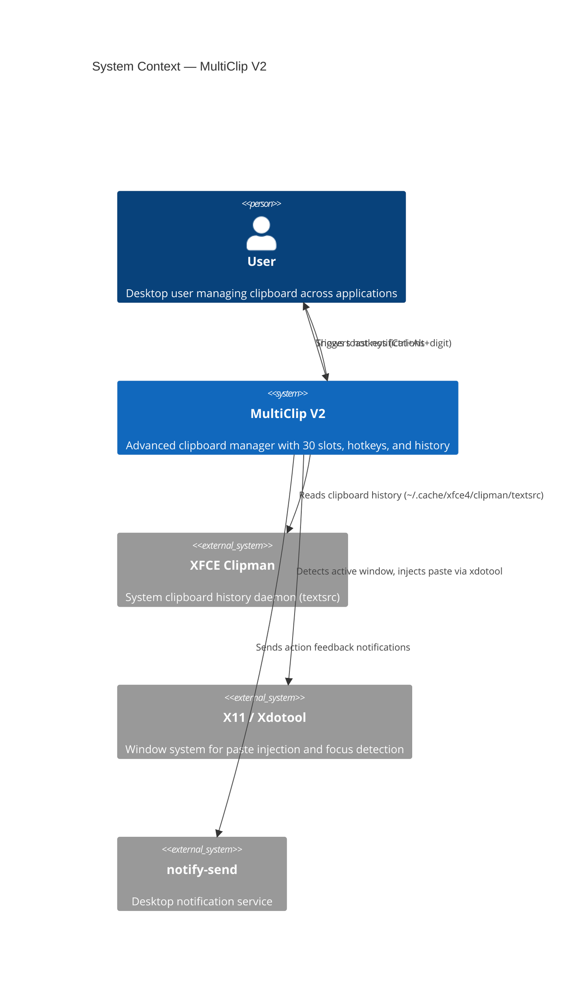

---

## 2. Container Diagram (C4 Container)

Internal containers and their responsibilities.

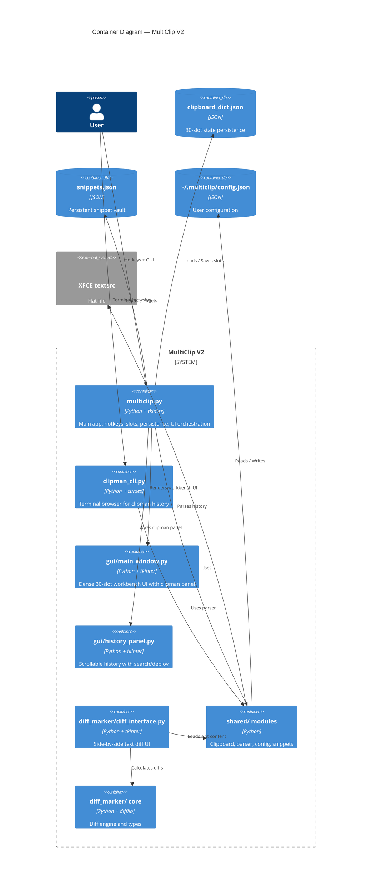

---

## 3. Class Diagram — Core Domain

Object model for clipboard management and clipman parsing.

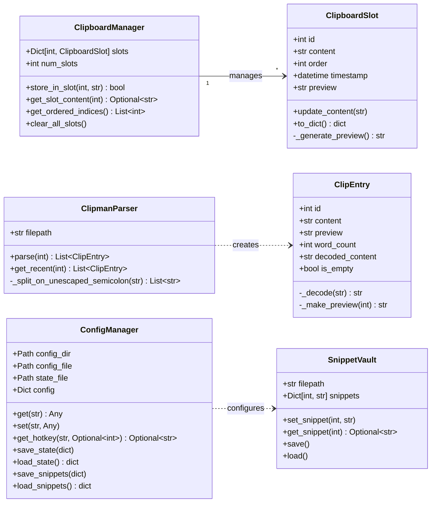

---

## 4. Class Diagram — Diff Marker Module

Diff comparison subsystem.

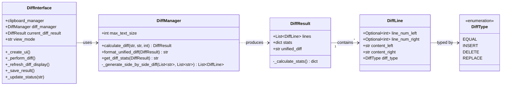

---

## 5. Flowchart — Hotkey Processing Pipeline

How the system handles global hotkey input to perform copy or paste actions.

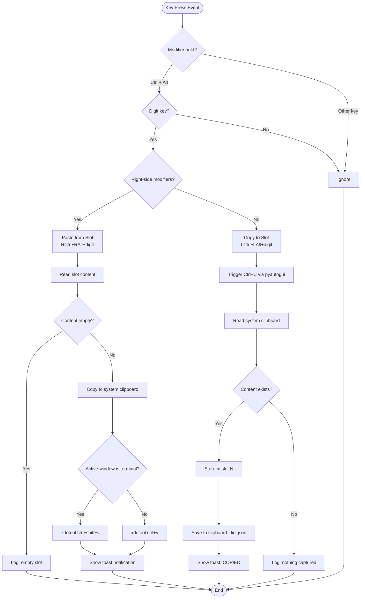

---

## 6. Sequence Diagram — Copy Operation

Interaction sequence when user copies selected text into a slot.

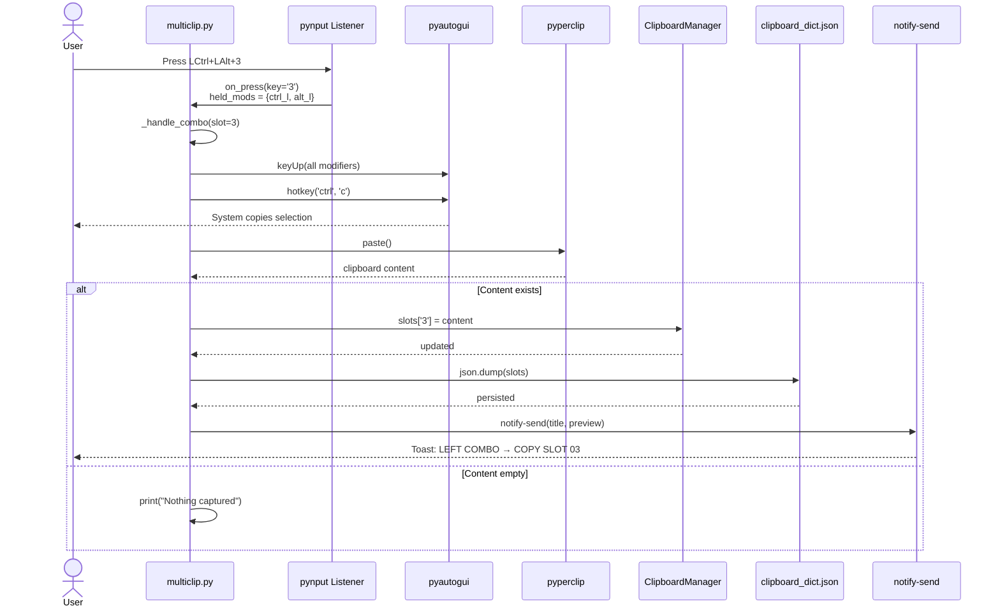

---

## 7. Sequence Diagram — Paste Operation

Interaction sequence when user pastes from a slot into the active window.

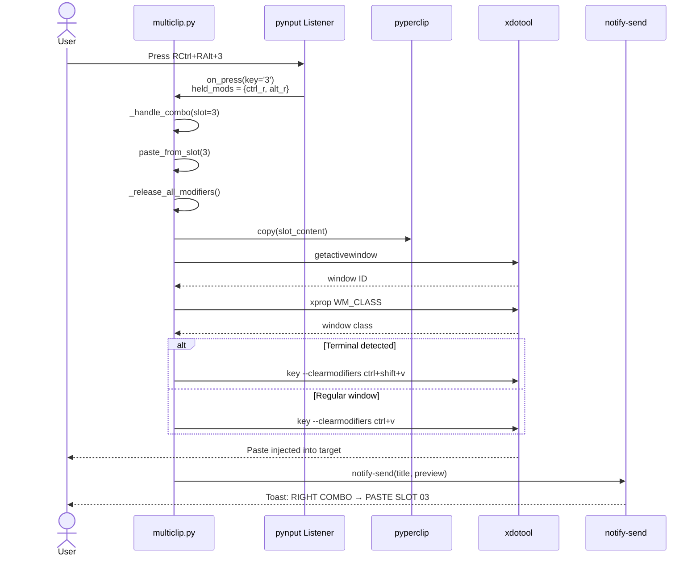

---

## 8. State Diagram — Application Lifecycle

States of the MultiClip V2 application from startup to shutdown.

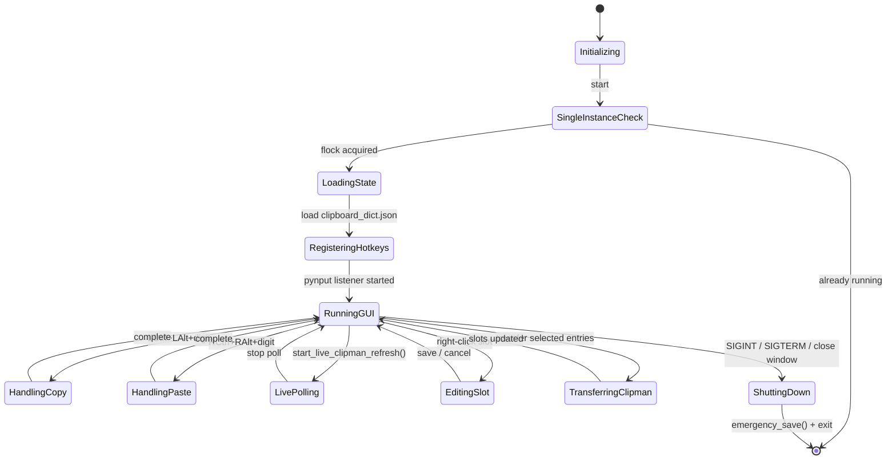

---

## 9. ER Diagram — Data Model

Relationships between persisted entities in the MultiClip system.

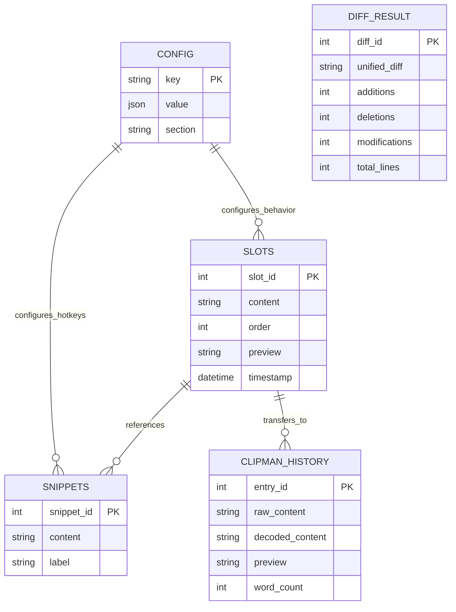

---

## 10. Mindmap — Project Feature Hierarchy

Hierarchical breakdown of MultiClip V2 capabilities.

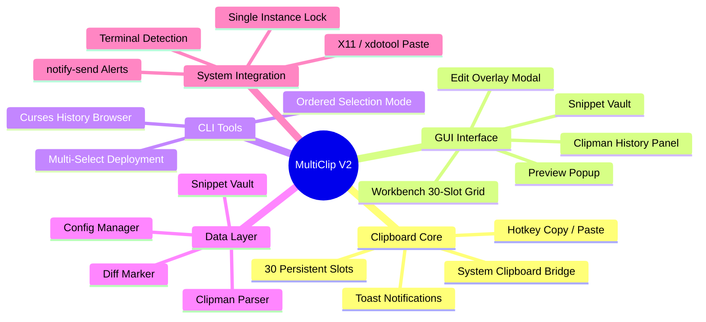

---

## 11. Flowchart — Clipman History Transfer Flow

How selected clipman history entries flow into OG slots.

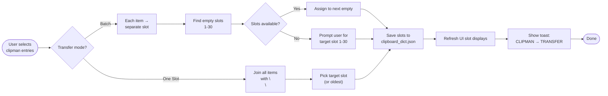

---

## 12. GitGraph — Development Branch History

Conceptual branch structure for the MultiClip V2 evolution.

```mermaid
gitgraph
    commit id: "initial-v1"
    commit id: "add-30-slots"
    branch feature/diff-marker
    commit id: "diff-engine"
    commit id: "diff-ui"
    checkout main
    merge feature/diff-marker tag: "v1.5"
    commit id: "add-clipman-parser"
    branch feature/clipman-integration
    commit id: "parser-module"
    commit id: "history-panel"
    commit id: "live-polling"
    checkout main
    merge feature/clipman-integration tag: "v2.0"
    commit id: "dense-gui-layout"
    branch hotfix/root-paste
    commit id: "xdotool-fallback"
    checkout main
    merge hotfix/root-paste tag: "v2.1"
    commit id: "snippet-vault"
    commit id: "config-manager"
```

---

## Legend

| Symbol / Pattern | Meaning |
| ---------------- | ------- |
| `C4Context` | Level 1 architecture — users and external systems |
| `C4Container` | Level 2 architecture — internal applications and data stores |
| `classDiagram` | OOP structure with inheritance, composition, and associations |
| `flowchart TD/LR` | Process flow with decisions and actions |
| `sequenceDiagram` | Time-ordered interaction between actors and components |
| `stateDiagram-v2` | Application state machine with transitions |
| `erDiagram` | Entity relationships and cardinality |
| `mindmap` | Hierarchical feature or concept breakdown |
| `gitgraph` | Branch and merge history |

---

*End of diagrams. Each visualization above is focused on a single concern per the mermaid-diagrams skill best practices.*
