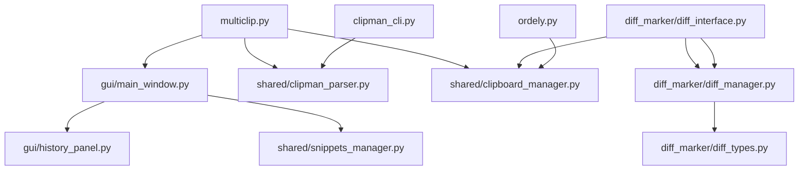
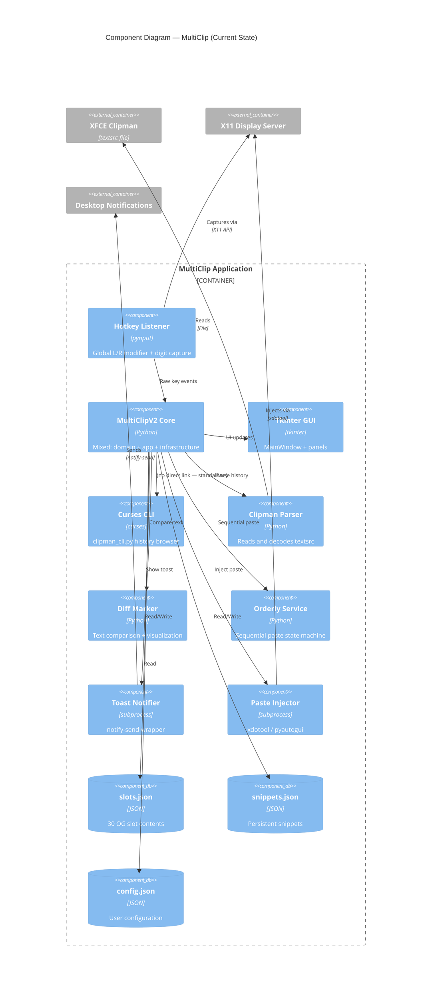

# MultiClip — Software Architecture Analysis

> **Document Type:** Architectural Assessment & Documentation  
> **Produced By:** `software-architecture` skill (Clean Architecture / DDD lens)  
> **Date:** 2026-05-26  
> **Scope:** `/home/flintx/multiclip` (entire Python codebase, ~6,016 SLOC)

---

## 1. Executive Summary

MultiClip is a single-process Python desktop application for MX Linux (XFCE) that provides 30 persistent clipboard slots, global hotkey-driven copy/paste, a Clipman history browser, sequential/batch paste modes, a snippet vault, and a text diff utility. It runs headlessly as a background hotkey daemon with an optional Tkinter GUI and a standalone curses CLI.

### Architecture Grade: **C+ / B-**

The project has a **working, pragmatic architecture** that delivers user value, but it exhibits significant **Clean Architecture and DDD violations** that create maintenance risk as the codebase grows past ~6,000 lines. The core issue is a **lack of clear architectural layers**: business logic, UI presentation, and infrastructure concerns are tightly coupled, especially in `multiclip.py` and `gui/main_window.py`.

### Key Findings

| Strength | Weakness |
|---|---|
| Single-instance guard with kernel flock | Business logic mixed with UI (Tkinter) in `multiclip.py` |
| Modular `diff_marker/` package with clear separation | `gui/main_window.py` is 835 lines — violates 200-line file limit |
| `ClipmanParser` cleanly abstracts Clipman file format | `shared/` directory uses generic naming (anti-pattern per skill) |
| Live polling for history refresh | No use of established libraries where appropriate (e.g., custom config manager instead of `pydantic-settings`) |
| Good terminal-aware paste injection | Deep nesting in hotkey handler (exceeds 3 levels) |
| Defensive modifier release | `multiclip.py` acts as both Application Controller and Domain Service |

---

## 2. Domain Analysis (DDD Ubiquitous Language)

Before evaluating structure, we define the domain language MultiClip operates in.

| Domain Term | Meaning |
|---|---|
| **OG Slot** | One of 30 numbered persistent clipboard storage positions (1–30) |
| **Clipman History** | The upstream XFCE Clipman log file (`textsrc`) containing all clipboard copies |
| **Transfer** | Moving selected Clipman history entries into OG slots |
| **Sequential Paste** | Walking through slots in a defined order, pasting one per trigger |
| **Batch Paste** | Dumping multiple slots at once |
| **Snippet** | Persistent reusable text fragment (email, command, proxy config) |
| **Vault** | Older name for the snippet storage area |
| **Orderly Mode** | A state machine where copies automatically fill slots in sequence |
| **Lock / Commit** | Mechanism to group selected history entries before transfer |

### Bounded Contexts

```
┌─────────────────────────────────────────────────────────────┐
│                    MULTICLIP SYSTEM                          │
│                                                              │
│  ┌─────────────────┐    ┌─────────────────────────────┐     │
│  │  Slot Context   │    │   History Browser Context   │     │
│  │  (30 OG slots)  │◄──►│   (Clipman textsrc parser)  │     │
│  │  • Store/Retrieve│    │   • Parse/browse/transfer   │     │
│  │  • Sequential    │    │   • Search/paginate         │     │
│  │  • Batch         │    │                             │     │
│  └─────────────────┘    └─────────────────────────────┘     │
│           ▲                          ▲                       │
│           │                          │                       │
│  ┌────────┴─────────┐    ┌───────────┴─────────────┐       │
│  │ Snippet Context  │    │    Diff/Marker Context   │       │
│  │ (persistent text)│    │    (text comparison)     │       │
│  └──────────────────┘    └──────────────────────────┘       │
│                                                              │
│  ┌─────────────────────────────────────────────────────┐    │
│  │         Infrastructure Context (cross-cutting)       │    │
│  │  • Hotkey listener (pynput) • Config persistence     │    │
│  │  • Toast notifications      • Paste injection        │    │
│  └─────────────────────────────────────────────────────┘    │
└─────────────────────────────────────────────────────────────┘
```

**Finding:** The codebase does **not** currently respect these boundaries. `multiclip.py` owns Slot logic, History wiring, Snippet wiring, and Infrastructure all in one 408-line file.

---

## 3. Layered Architecture Assessment

Clean Architecture prescribes four layers:

1. **Domain** — Entities, value objects, domain services (framework-free)
2. **Use Case / Application** — Orchestration, workflows, DTOs
3. **Interface Adapters** — Controllers, presenters, view models
4. **Infrastructure / Frameworks** — UI frameworks, databases, external APIs, OS calls

### Current Layer Mapping

| File | Lines | Current Role | Clean Layer Violation |
|---|---|---|---|
| `multiclip.py` | 408 | Application + Domain + Infrastructure | **ALL LAYERS MIXED** — initializes Tkinter, calls `xdotool`, owns slot logic |
| `gui/main_window.py` | 835 | UI (Tkinter) + Application logic | Interface Adapter layer bleeds into Use Case |
| `gui/history_panel.py` | 360 | UI widget | Mostly Interface Adapter (good) |
| `shared/clipboard_manager.py` | 47 | Domain entity + repository | Clean, but too small; should be expanded |
| `shared/clipman_parser.py` | 157 | Infrastructure adapter | Correctly placed as Infrastructure |
| `shared/config_manager.py` | 132 | Infrastructure (persistence) | Correctly placed |
| `shared/snippets_manager.py` | 46 | Domain + repository | Clean but minimal |
| `diff_marker/diff_manager.py` | 102 | Domain service | **Correct** — pure business logic |
| `diff_marker/diff_interface.py` | 382 | UI widget | Interface Adapter (good) |
| `diff_marker/diff_types.py` | 44 | Domain value objects | **Correct** — pure data |
| `clipman_cli.py` | 325 | CLI adapter + application | Mixes curses UI with use-case logic |
| `ordely.py` | 146 | Domain service | **Correct** — state machine logic |

### Critical Violation: `multiclip.py`

This file violates **Separation of Concerns** in five ways:

1. **UI initialization** (`tk.Tk()`, `self.ui.run()`)
2. **Infrastructure calls** (`subprocess.run(["xdotool", ...])`, `notify-send`)
3. **Domain logic** (slot storage/retrieval, Clipman transfer rules)
4. **Application lifecycle** (single-instance guard, signal handlers, atexit)
5. **OS integration** (`fcntl.flock`, `pyautogui` modifier release)

**Recommendation:** Split `multiclip.py` into:
- `domain/slot_service.py` — pure slot operations
- `application/app_controller.py` — orchestrates startup, mode switching
- `infrastructure/hotkey_listener.py` — pynput wrapper
- `infrastructure/paste_injector.py` — xdotool/pyautogui abstraction
- `presentation/tkinter_app.py` — UI composition root

---

## 4. Naming Convention Audit

The skill mandates: **AVOID generic names** (`utils`, `helpers`, `common`, `shared`). Use **domain-specific names**.

### Current Naming Issues

| Anti-Pattern | Location | Severity | Fix |
|---|---|---|---|
| `shared/` directory | Project root | **HIGH** | Rename to `core/` or `domain/` |
| `shared/clipboard_manager.py` | Generic | **MEDIUM** | `domain/slot_repository.py` or `core/clipboard_slots.py` |
| `shared/snippets_manager.py` | Generic | **MEDIUM** | `domain/snippet_vault.py` |
| `shared/config_manager.py` | Generic | **LOW** | Acceptable, but `infrastructure/config_store.py` is better |
| `shared/clipman_parser.py` | Generic | **LOW** | `infrastructure/clipman_textsrc_adapter.py` |
| `ordely.py` | Misspelled, vague | **MEDIUM** | `domain/sequential_paste_service.py` |
| `dsfdsfsdf.py` | Nonsense name | **HIGH** | Delete or rename immediately |
| `snippers-save.py`, `snippers-view.py` | Inconsistent naming | **MEDIUM** | Consolidate into `presentation/snippet_cli.py` |

### Positive Naming Examples

| Good Name | Why It Works |
|---|---|
| `ClipmanParser` | Domain-specific; tells you exactly what it parses |
| `DiffManager` | Domain-specific; manages diffs |
| `DiffResult`, `DiffLine`, `DiffType` | Value objects with clear purpose |
| `ClipboardSlot` | Domain entity with identity |
| `OrderlyManager` | Domain service for orderly (sequential) mode |

---

## 5. Component Analysis

### 5.1 Domain Layer (Business Logic)

**Current state:** Business logic is scattered. Only `diff_marker/diff_types.py`, `diff_marker/diff_manager.py`, and `ordely.py` come close to pure domain logic.

**Entities:**

```python
# Good: Clear entity with identity
class ClipboardSlot:
    def __init__(self, slot_id: int, content: str = "", order: int = 0):
        self.id = slot_id
        ...

# Good: Value object (dataclass)
@dataclass
class ClipEntry:
    id: int
    content: str
    preview: str = ""
    word_count: int = 0

# Good: Value object (enum)
class DiffType(Enum):
    EQUAL = "equal"
    INSERT = "insert"
    ...
```

**Missing Domain Services:**
- `SlotTransferService` — rules for filling empty slots, handling full-slot warnings
- `PasteSequenceService` — orchestrates sequential/batch paste workflows
- `HotkeyInterpreter` — maps raw pynput events to domain actions

### 5.2 Use Case / Application Layer

**Current state:** Effectively missing. `multiclip.py` tries to be the application layer but is polluted with infrastructure.

**Use cases that should be explicit:**

1. **CopyToSlot** — capture selection → store in slot → show toast
2. **PasteFromSlot** — retrieve slot → stage clipboard → inject paste → show toast
3. **TransferFromHistory** — select entries → fill empty slots → persist
4. **SequentialPaste** — walk ordered slots → paste each → update progress
5. **BrowseHistory** — load page → render → handle pagination

### 5.3 Interface Adapters (Presentation)

**Tkinter GUI (`gui/`):**

| Component | Lines | Assessment |
|---|---|---|
| `MainWindow` | 835 | **Too large.** Violates 200-line file rule. Contains mode switching, Clipman pagination, snippet persistence, vault management, and toast rendering. |
| `HistoryPanel` | 360 | Acceptable. Could be split into `HistoryList` + `HistoryFooter`. |
| `SlotDisplay` | ~67 (embedded) | Good small widget. Should be extracted to own file. |
| `EditOverlay` | ~43 (embedded) | Good small widget. Extract to own file. |
| `ClipmanPreviewPopup` | ~141 (embedded) | Too large to be embedded. Extract to own file. |

**Recommendation for `MainWindow`:**
- Extract `Toolbar` (~30 lines)
- Extract `SlotGrid` (~50 lines)
- Extract `SnippetsPanel` (~30 lines)
- Extract `VaultPanel` (~30 lines)
- Extract `ClipmanPanel` (~120 lines)
- Extract `StatusBar` (~15 lines)
- Keep `MainWindow` as a **composition root** only (~80 lines)

**Curses CLI (`clipman_cli.py`):**

- 325 lines. Violates 200-line rule.
- Mixes curses rendering with selection logic and deploy logic.
- **Split into:** `presentation/curses_browser.py` (UI) + `application/history_browse_usecase.py` (logic).

### 5.4 Infrastructure Layer

**Current infrastructure components:**

| Component | Technology | Role | Assessment |
|---|---|---|---|
| `ClipmanParser` | File I/O | Reads `textsrc` | Good adapter pattern |
| `ConfigManager` | JSON files | Settings persistence | Good; could use `pydantic-settings` |
| `pyperclip` | Library | Clipboard bridge | Correct library-first choice |
| `pynput` | Library | Global hotkeys | Correct library-first choice |
| `xdotool` | CLI | Paste injection | Correct fallback strategy |
| `notify-send` | CLI | Toast notifications | Simple and effective |

**Infrastructure gap:** There is no abstraction layer for OS-level operations. `multiclip.py` calls `subprocess.run(["xdotool", ...])` directly. A `PasteInjector` interface with `XdotoolInjector` and `PyautoguiInjector` implementations would follow the Dependency Inversion Principle.

---

## 6. Code Quality Assessment

### 6.1 Early Return Pattern

**Skill rule:** Always use early returns over nested conditions.

**Finding:** Partial compliance.

- ✅ `clipboard_manager.py` uses early returns in `store_in_slot`, `get_slot_content`
- ✅ `clipman_parser.py` uses early returns in `parse`
- ❌ `multiclip.py` `_handle_combo` nests modifier checks deeply
- ❌ `main_window.py` `_on_item_select` nests mode checks

### 6.2 Function Length

**Skill rule:** Keep functions focused and under 50 lines when possible.

| File | Violations |
|---|---|
| `multiclip.py` | `_register_hotkeys` (~45 lines — borderline), `_transfer_clipman_to_og_slots` (~55 lines), `_wire_clipman_panel` (~28 lines — OK), `_build_simple_ui` (~12 lines — OK) |
| `main_window.py` | `_create_ui` (~200+ lines), `show_toast` (~70 lines), `_on_clipman_transfer_batch` (~50 lines), `__init__` (~25 lines — OK) |
| `diff_interface.py` | `_create_input_tab` (~75 lines), `_create_result_tab` (~25 lines — OK), `_perform_diff` (~28 lines — OK) |

### 6.3 File Length

**Skill rule:** Keep files focused and under 200 lines of code when possible.

| File | Lines | Violation |
|---|---|---|
| `multiclip.py` | 408 | **SEVERE** |
| `main_window.py` | 835 | **SEVERE** |
| `clipman_cli.py` | 325 | **MODERATE** |
| `diff_interface.py` | 382 | **SEVERE** |
| `history_panel.py` | 360 | **MODERATE** |
| `snippers-view.py` | 420 | **SEVERE** |
| `snippers-save.py` | 376 | **SEVERE** |
| `dsp-cli.py` | 1,091 | **CRITICAL** |

### 6.4 Nesting Depth

**Skill rule:** Avoid deep nesting (max 3 levels).

- ❌ `multiclip.py` `load_slots`: 4+ levels of `if/try/with/if/isinstance/for/if/if`
- ❌ `multiclip.py` `_handle_combo`: nested `if` checks for modifiers
- ❌ `main_window.py` `_create_ui`: nested frame creation within frame creation

---

## 7. Anti-Patterns Detected

### 7.1 NIH (Not Invented Here) Syndrome

| Instance | Current Approach | Recommended Library |
|---|---|---|
| Config management | Custom `ConfigManager` (132 lines) | `pydantic-settings`, `python-dotenv` |
| Diff calculation | Custom `DiffManager` around `difflib` | Acceptable — `difflib` is stdlib, wrapper is justified |
| JSON persistence | Manual `json.dump` in every module | `tinydb`, `jsonpickle`, or keep simple |

**Verdict:** Config management is the clearest NIH case. A 132-line custom config manager with dot-path getters (`get("hotkeys.copy_to_slot")`) could be replaced with `pydantic-settings` or a typed dataclass for better maintainability.

### 7.2 Mixing Business Logic with UI

**Location:** `multiclip.py`, `main_window.py`

Example from `multiclip.py`:
```python
# Domain logic (transfer rules) mixed with UI (simpledialog)
from tkinter import simpledialog, messagebox
msg = "ALL 30 OG SLOTS ARE FULL..."
slot = simpledialog.askinteger("SLOTS FULL — Choose Target", msg, ...)
```

The slot-transfer use case should return a `TransferResult` object. The UI layer should decide how to present the warning.

### 7.3 Generic Naming (`shared/`)

The `shared/` directory is a **dumping ground** that will accumulate unrelated utilities over time. Already at risk — `shared/` contains clipboard, parser, config, and snippets with no clear cohesion beyond "used by multiple modules."

### 7.4 God Object / God Class

- `MultiClipV2` (in `multiclip.py`) holds slots, UI, listener, parser, and transfer logic
- `MainWindow` holds toolbar, slots, snippets, vault, Clipman panel, status bar, and callbacks

---

## 8. Dependency Analysis

### External Dependencies

| Package | Purpose | Assessment |
|---|---|---|
| `pyperclip` | Clipboard read/write | ✅ Justified, stdlib has no cross-platform clipboard |
| `pyautogui` | GUI automation fallback | ✅ Justified, but only as fallback to `xdotool` |
| `pynput` | Global hotkey listener | ✅ Justified, no stdlib equivalent |
| `tkinter` | GUI framework | ✅ Standard library |
| `curses` | CLI UI | ✅ Standard library |
| `difflib` | Diff engine | ✅ Standard library |

**No dependency security concerns.** All are well-maintained, standard or widely-used packages.

### Internal Dependencies



**Finding:** `multiclip.py` is the **center of the dependency universe**. Everything flows through it. This creates a **hub-and-spoke architecture** where `multiclip.py` is a single point of failure and a coordination bottleneck.

---

## 9. Data Flow Architecture

### 9.1 Hotkey-Driven Copy Flow

```
User selects text + presses LCtrl+LAlt+3
        │
        ▼
┌───────────────┐
│ pynput Listener│  (Infrastructure)
└───────┬───────┘
        │ on_press / on_release
        ▼
┌───────────────┐
│ MultiClipV2   │  (Application — currently mixed)
│ _handle_combo │
└───────┬───────┘
        │ slot=3, action=COPY
        ▼
┌───────────────┐
│ pyautogui     │  (Infrastructure)
│ ctrl+c        │
└───────┬───────┘
        │ clipboard now has text
        ▼
┌───────────────┐
│ pyperclip.paste│  (Infrastructure)
└───────┬───────┘
        │ content
        ▼
┌───────────────┐
│ slots["3"]    │  (Domain)
└───────┬───────┘
        │
        ▼
┌───────────────┐
│ clipboard_dict.json  (Infrastructure)
└───────────────┘
        │
        ▼
┌───────────────┐
│ notify-send   │  (Infrastructure)
│ Toast "Slot 3 │
│ captured"     │
└───────────────┘
```

### 9.2 Clipman History Transfer Flow

```
User selects entries in GUI + presses Transfer
        │
        ▼
┌───────────────┐
│ MainWindow    │  (Interface Adapter)
│ _on_clipman_  │
│ transfer_batch│
└───────┬───────┘
        │ selected entries
        ▼
┌───────────────┐
│ MultiClipV2   │  (Application — currently mixed)
│ _transfer_    │
│ clipman_to_   │
│ og_slots      │
└───────┬───────┘
        │ fill-empty-first / warn-if-full
        ▼
┌───────────────┐
│ slots dict    │  (Domain)
└───────┬───────┘
        │
        ▼
┌───────────────┐
│ JSON save     │  (Infrastructure)
└───────┬───────┘
        │
        ▼
┌───────────────┐
│ SlotDisplay   │  (Interface Adapter)
│ updates       │
└───────────────┘
```

---

## 10. Refactoring Recommendations

### 10.1 Immediate (High Impact, Low Effort)

1. **Delete or rename `dsfdsfsdf.py`** — unprofessional, blocks code search clarity
2. **Rename `shared/` → `core/` or `domain/`** — follows naming conventions
3. **Extract `SlotDisplay` from `main_window.py`** — into `gui/slot_display.py`
4. **Extract `EditOverlay` from `main_window.py`** — into `gui/edit_overlay.py`
5. **Extract `ClipmanPreviewPopup` from `main_window.py`** — into `gui/clipman_preview.py`
6. **Add `__all__` exports** to `diff_marker/__init__.py` (currently empty)

### 10.2 Short-Term (High Impact, Medium Effort)

1. **Split `multiclip.py` into layers:**
   ```
   application/
   ├── app_controller.py      (startup, lifecycle, mode switching)
   └── use_cases/
       ├── copy_to_slot.py
       ├── paste_from_slot.py
       └── transfer_from_history.py
   
   infrastructure/
   ├── hotkey_listener.py     (pynput wrapper)
   ├── paste_injector.py      (xdotool/pyautogui abstraction)
   ├── toast_notifier.py      (notify-send wrapper)
   └── persistence/
       ├── slot_store.py      (JSON read/write for slots)
       └── snippet_store.py   (JSON read/write for snippets)
   
   presentation/
   ├── tkinter_app.py         (composition root)
   └── cli_app.py             (curses composition root)
   ```

2. **Introduce a `PasteInjector` protocol:**
   ```python
   from typing import Protocol
   
   class PasteInjector(Protocol):
       def inject_paste(self, is_terminal: bool) -> bool: ...
   
   class XdotoolInjector:
       def inject_paste(self, is_terminal: bool) -> bool:
           cmd = ["xdotool", "key", "--clearmodifiers",
                  "ctrl+shift+v" if is_terminal else "ctrl+v"]
           result = subprocess.run(cmd, timeout=1.0, check=False)
           return result.returncode == 0
   
   class PyautoguiInjector:
       def inject_paste(self, is_terminal: bool) -> bool:
           keys = ["ctrl", "shift", "v"] if is_terminal else ["ctrl", "v"]
           pyautogui.hotkey(*keys)
           return True
   ```

3. **Introduce `TransferResult` for history→slot transfers:**
   ```python
   from dataclasses import dataclass
   from enum import Enum, auto
   
   class TransferStatus(Enum):
       SUCCESS = auto()
       SLOTS_FULL = auto()
       PARTIAL = auto()
   
   @dataclass
   class TransferResult:
       status: TransferStatus
       filled_slots: list[int]
       remaining_items: list[str]
       message: str
   ```

### 10.3 Medium-Term (Strategic)

1. **Adopt `pydantic-settings` for configuration** — replaces custom `ConfigManager` with typed, validated settings
2. **Introduce a lightweight event bus** — decouple hotkey events from UI updates
   ```python
   # Instead of MainWindow knowing about SlotDisplay updates:
   event_bus.publish(SlotUpdated(slot_id=3, content="..."))
   # SlotDisplay subscribes and updates itself
   ```
3. **Add unit tests for domain logic** — `clipboard_manager.py`, `ordely.py`, `diff_manager.py` are pure enough to test without mocking Tkinter
4. **Consider `typer` or `click` for CLI** — replaces manual `argparse` in `clipman_cli.py` with typed commands

---

## 11. Security & Robustness

| Aspect | Status | Notes |
|---|---|---|
| Single-instance guard | ✅ Strong | Kernel `flock` in `/tmp/multiclip.lock` |
| Root context handling | ✅ Thoughtful | `SUDO_USER` fallback, hardcoded `/home/flintx` fallback |
| Input size limits | ✅ Present | DiffManager limits to 1MB |
| Error handling | ⚠️ Partial | Many `try/except: pass` blocks swallow errors silently |
| Path traversal | ⚠️ Risk | `os.path.join(self.base_dir, ...)` is safe, but hardcoded paths exist |
| Injection risk | ✅ Low | No eval/exec; all subprocess calls use fixed command lists |

**Silent failure pattern:** The codebase uses `try/except: pass` or `except Exception as e: print(e)` extensively. This is a maintenance hazard — errors are logged to stdout but never propagated.

**Recommendation:** Replace silent catches with a small `Result[T, E]` type or at minimum log to `logging.error` with stack traces.

---

## 12. Testing Architecture

**Current state:** Ad-hoc test scripts exist but no test framework.

| Test File | Purpose | Framework |
|---|---|---|
| `test_original.py` | Manual hotkey test | ❌ None |
| `test_clipman_parser.py` | Parser diagnostic | ❌ None |
| `test_clipman_integration.py` | Integration demo | ❌ None |
| `test_hotkeys.py` | Hotkey behavior | ❌ None |
| `test_hotkeys_v2.py` | Hotkey behavior v2 | ❌ None |
| `test_modifiers.py` | Modifier detection | ❌ None |
| `test_unified.py` | Unified test | ❌ None |
| `test_clipboard_monitor.py` | Clipboard monitor | ❌ None |

**Recommendation:** Introduce `pytest` and organize tests by layer:
```
tests/
├── unit/
│   ├── domain/
│   │   ├── test_slot_transfer_service.py
│   │   ├── test_sequential_paste_service.py
│   │   └── test_diff_manager.py
│   └── infrastructure/
│       ├── test_clipman_parser.py
│       └── test_config_manager.py
├── integration/
│   ├── test_hotkey_listener.py
│   └── test_paste_injector.py
└── e2e/
    └── test_full_workflow.py
```

---

## 13. Mermaid Component Diagram



---

## 14. Conclusion & Priority Matrix

### What to Keep

1. ✅ **The `diff_marker/` module** — best example of clean separation in the codebase
2. ✅ **Clipman parser abstraction** — correctly isolates external file format complexity
3. ✅ **Single-instance flock guard** — robust, kernel-level correctness
4. ✅ **Library-first choices** (`pyperclip`, `pynput`, `difflib`) — no unnecessary custom code
5. ✅ **Terminal-aware paste injection** — thoughtful root-context handling

### What to Change (Prioritized)

| Priority | Item | Effort | Impact |
|---|---|---|---|
| P0 | Delete/rename `dsfdsfsdf.py` | 5 min | Professionalism |
| P0 | Rename `shared/` → `core/` | 15 min | Naming convention |
| P1 | Extract `SlotDisplay`, `EditOverlay`, `ClipmanPreviewPopup` | 1 hour | File size compliance |
| P1 | Split `multiclip.py` into App Controller + Use Cases + Infrastructure | 4 hours | Layer separation |
| P1 | Extract `PasteInjector` protocol | 30 min | Testability |
| P2 | Split `MainWindow` into sub-components | 3 hours | Maintainability |
| P2 | Introduce `TransferResult` for slot-transfer use case | 1 hour | Clean domain logic |
| P2 | Add `pytest` test suite for domain layer | 4 hours | Regression safety |
| P3 | Replace custom `ConfigManager` with `pydantic-settings` | 2 hours | Type safety |
| P3 | Introduce lightweight event bus | 3 hours | Decoupling |

### Architecture Target State

```
┌─────────────────────────────────────────────────────────────┐
│                  MULTICLIP (TARGET STATE)                    │
│                                                              │
│  ┌─────────────────────────────────────────────────────┐    │
│  │              PRESENTATION LAYER                      │    │
│  │  • tkinter_app.py (composition)                     │    │
│  │  • curses_app.py (composition)                      │    │
│  │  • slot_display.py, history_panel.py, etc.          │    │
│  └─────────────────────────────────────────────────────┘    │
│                          ▲                                   │
│  ┌───────────────────────┼─────────────────────────────┐    │
│  │         APPLICATION / USE CASE LAYER                 │    │
│  │  • copy_to_slot.py   • paste_from_slot.py           │    │
│  │  • transfer_history.py • sequential_paste.py        │    │
│  │  • app_controller.py (orchestration)                │    │
│  └─────────────────────────────────────────────────────┘    │
│                          ▲                                   │
│  ┌───────────────────────┼─────────────────────────────┐    │
│  │                DOMAIN LAYER                          │    │
│  │  • slot.py (entity)  • slot_repository.py (port)    │    │
│  │  • transfer_service.py • sequential_service.py      │    │
│  │  • diff_types.py, diff_manager.py                   │    │
│  └─────────────────────────────────────────────────────┘    │
│                          ▲                                   │
│  ┌───────────────────────┼─────────────────────────────┐    │
│  │             INFRASTRUCTURE LAYER                     │    │
│  │  • hotkey_listener.py  • paste_injector.py          │    │
│  │  • toast_notifier.py   • clipman_parser.py          │    │
│  │  • config_store.py     • json_slot_store.py         │    │
│  └─────────────────────────────────────────────────────┘    │
└─────────────────────────────────────────────────────────────┘
```

This target state respects **Clean Architecture** boundaries, eliminates the `shared/` anti-pattern, keeps files under 200 lines, and ensures business logic remains independent of Tkinter, curses, `xdotool`, and `pynput`.

---

*End of Software Architecture Analysis.*
